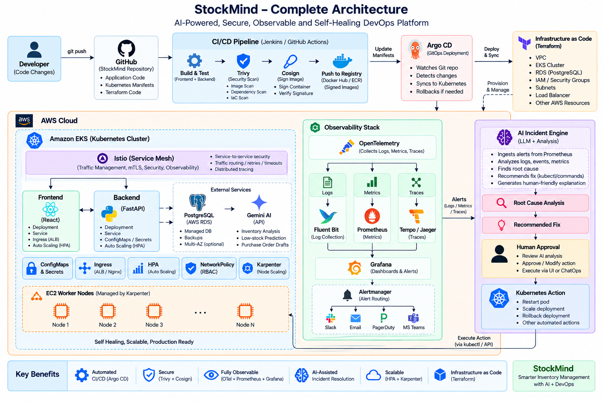
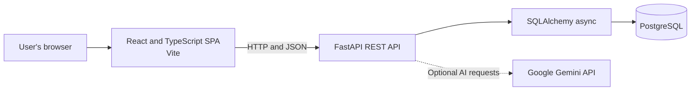
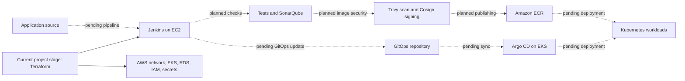

# StockMind Ops

StockMind is an inventory and supply-chain management application for products, warehouses, stock movements, suppliers, customers, purchase orders, and sales orders. This repository contains the application source and the Terraform foundations for its planned DevOps environment.

## Architecture Design

The diagram below is the target architecture design. The project is currently at the Terraform stage; later CI/CD and platform components are still to be added and connected.



### Application request flow



The frontend calls the versioned API at `/api/v1`. FastAPI validates requests and responses with Pydantic, accesses PostgreSQL through SQLAlchemy and asyncpg, and uses authentication and organization context for application operations. Alembic manages schema migrations. The Gemini integration is an optional **application feature** for demand forecasts and purchase-order suggestions; it is separate from the future DevOps AI idea described below.

### Planned delivery flow



Terraform is the current milestone. The intended responsibility split is **Terraform for AWS infrastructure and Argo CD bootstrap**, **Jenkins for CI**, and **Argo CD for Kubernetes applications and platform services**. The Terraform code lays foundations for those components, but the Jenkins pipeline, GitOps repository definitions, Kubernetes workload manifests, and end-to-end release flow remain future implementation work.

## Application Capabilities

- Authentication and organization-scoped data.
- Product catalog, categories, suppliers, customers, and warehouses.
- Inventory adjustments and a transaction ledger for stock movements.
- Purchase orders and sales orders.
- Alerts, analytics, and an AI assistant for forecasts and reorder suggestions.
- A dashboard and pages for the main inventory workflows.

The API exposes interactive documentation at `/docs` and a health endpoint at `/health` when running locally.

## Tools and Technologies

| Area | Tools | Role in the project |
| --- | --- | --- |
| Frontend | React 19, TypeScript, Vite, React Router | Single-page application, routes, and development/build tooling. |
| Frontend data and UI | TanStack Query, Axios, Zustand, Tailwind CSS, lucide-react | API requests and caching, HTTP client, client-side state, styling, and icons. |
| Backend | Python 3.10, FastAPI, Pydantic | REST API, request validation, and OpenAPI documentation. |
| Data access | SQLAlchemy async, asyncpg, Alembic | PostgreSQL access and database migrations. |
| Authentication and app AI | JWT libraries, Google Gemini API | Token-based authentication and optional inventory-related AI features. |
| Database | PostgreSQL 15 in Docker Compose; Amazon RDS in the Terraform design | Local persistence and the planned AWS database. |
| Containers | Docker, Docker Compose | Build and run the frontend, backend, and local database together. |
| Infrastructure | Terraform, AWS VPC, EKS, EC2, RDS, ECR, IAM, Secrets Manager | Provision the CI host and AWS application platform foundations. |
| Planned CI/security | Jenkins, SonarQube, Trivy, Cosign | Build automation, code analysis, image vulnerability scanning, and image signing. CI Terraform installs these tools and creates ECR repositories; pipeline configuration is still pending. |
| Planned Kubernetes delivery | Kubernetes, Helm, Argo CD, AWS Load Balancer Controller | Cluster delivery and GitOps. Terraform bootstraps Argo CD and installs the load balancer controller; workload definitions are still pending. |
| Checks | pytest, Oxlint, TypeScript compiler | Backend tests, frontend linting, and frontend type/build checks. |

The CD design also lists Istio, Prometheus, Grafana, Alertmanager, Loki, Fluent Bit, OpenTelemetry, and Tempo as intended GitOps-managed platform services. Their Kubernetes definitions are not included in this repository yet.

## Repository Layout

```text
src/
	Images/Stock_mind_Architecture.png   Architecture design image
	StockMind/
		backend/                           FastAPI service, migrations, and tests
		frontend/                          React and TypeScript application
		docker-compose.yml                 Local application stack
terraform/
	CI/                                  Jenkins EC2 host and ECR foundations
	CD/                                  AWS EKS, RDS, networking, and Argo CD
```

Additional setup detail is in [src/StockMind/README.md](src/StockMind/README.md). Terraform details are in [terraform/CI/CI_Terraform.md](terraform/CI/CI_Terraform.md) and [terraform/CD/CD_Terraform.md](terraform/CD/CD_Terraform.md).

## Run the Application Locally

### Prerequisites

- Docker Desktop (or Docker Engine) with the Docker Compose plugin.
- Git, if cloning the repository.
- A Google Gemini API key only if using the application's AI features.

### Start

From the repository root, run in PowerShell:

```powershell
Set-Location src/StockMind
Copy-Item backend/.env.example backend/.env
```

Edit `backend/.env`: set a private `SECRET_KEY`; configure `GEMINI_API_KEY` to enable Gemini features. The example file contains development database credentials and a development signing key. Do not reuse those values in a deployed environment.

Build and start the services:

```powershell
docker compose up --build -d
```

Open:

- Frontend: [http://localhost:5173](http://localhost:5173)
- API documentation: [http://localhost:8000/docs](http://localhost:8000/docs)
- Health check: [http://localhost:8000/health](http://localhost:8000/health)

The backend container runs `alembic upgrade head` before starting the API. Compose configures the backend to reach PostgreSQL through the `db` service. The frontend's default API URL, `http://localhost:8000/api/v1`, is the browser-accessible local API address.

Stop the services and preserve the database volume with:

```powershell
docker compose down
```

### Run checks

With the services running, run backend tests from `src/StockMind`:

```powershell
docker compose exec backend pytest
```

Run frontend lint and build checks:

```powershell
Set-Location frontend
npm install
npm run lint
npm run build
```

## Terraform: Current Project Stage

The Terraform directories are separate stacks. Provisioning requires AWS credentials, Terraform, and the prerequisites documented for each stack. AWS resources may incur charges; review the Terraform plan and security settings before applying.

### CI foundations (`terraform/CI`)

This stack defines a CI EC2 host, installs Jenkins and supporting tools, and creates private ECR repositories with an IAM role for image publishing. The CI setup notes require an existing or separately created VPC and subnet plus an EC2 key pair. Configure a local `terraform.tfvars` from `terraform.tfvars.example`, then run:

```powershell
terraform init
terraform fmt -recursive
terraform validate
terraform plan
terraform apply
```

### CD foundations (`terraform/CD`)

This stack defines the AWS network, EKS cluster and managed node group, RDS PostgreSQL, application secrets, IAM roles, the AWS Load Balancer Controller, and an Argo CD bootstrap installation. Create this stack's own `terraform.tfvars` from `terraform.tfvars.example`; review and apply it using the Terraform commands above.

Do not commit `terraform.tfvars`, real API keys, JWT secrets, or application `.env` files. The CI/CD pipeline and GitOps workload definitions are follow-on work, not a completed deployment workflow.

## Future Idea: DevOps AI Assistant

After the project and its observability stack are in place, a future DevOps AI assistant could analyze operational logs, metrics, and traces, then recommend possible actions. Any action that changes infrastructure or workloads would be presented for human approval before execution. This is a roadmap idea only: the assistant, telemetry ingestion, recommendation workflow, and approval/execution integration are not implemented or part of the current Terraform milestone.

## License

This project is for demonstration and portfolio purposes.
