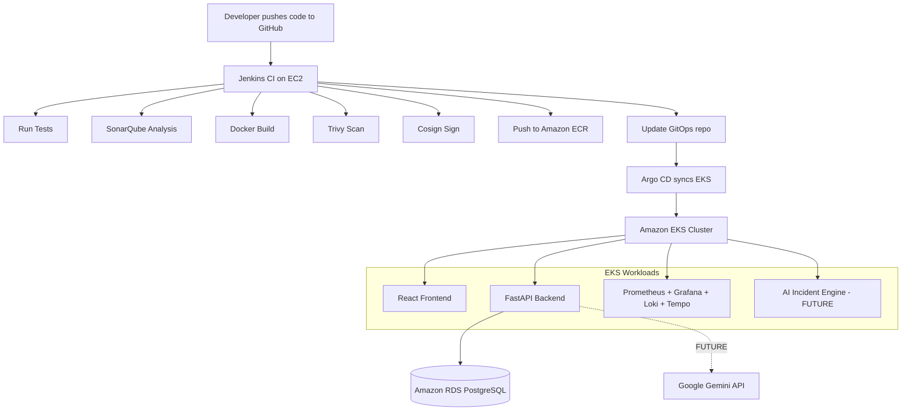
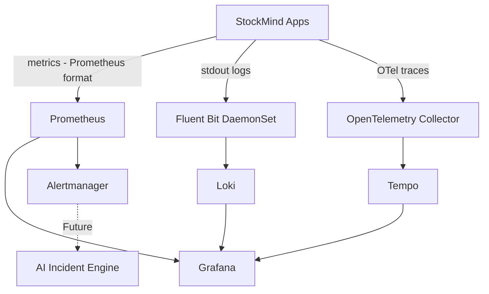

# StockMind — Complete Setup Guide

> **Document purpose:** This is the end-to-end, phase-by-phase setup guide for the StockMind platform.
> It tells you exactly **what to do, why you are doing it, what evidence to check, and what comes next** at every stage.
>
> The project is currently at **Phase 1 & 2 (Terraform foundation) — IMPLEMENTED**.
> Every phase after that is **PLANNED**.

---

## End Goal



---

## Table of Contents

1. [Prerequisites](#prerequisites)
2. [Phase 1 — Terraform CI Foundation](#phase-1--terraform-ci-foundation-implemented)
3. [Phase 1.5 — Ansible Configuration Management](#phase-15--ansible-configuration-management)
4. [Phase 2 — Terraform CD Foundation](#phase-2--terraform-cd-foundation-implemented)
5. [Phase 3 — Application Containerization](#phase-3--application-containerization)
6. [Phase 4 — First Manual Deployment to EKS](#phase-4--first-manual-deployment-to-eks)
7. [Phase 5 — Jenkins CI Pipeline](#phase-5--jenkins-ci-pipeline)
8. [Phase 6 — Security Scanning and Image Signing](#phase-6--security-scanning-and-image-signing)
9. [Phase 7 — Argo CD GitOps](#phase-7--argo-cd-gitops)
10. [Phase 8 — Observability](#phase-8--observability)
11. [Phase 9 — Autoscaling and Reliability](#phase-9--autoscaling-and-reliability)
12. [Phase 10 — Security Hardening](#phase-10--security-hardening)
13. [Phase 11 — AI Incident Engine](#phase-11--ai-incident-engine)
14. [Phase 12 — Controlled Remediation](#phase-12--controlled-remediation)
15. [Phase 13 — Cost Optimization](#phase-13--cost-optimization)
16. [Verification Checklist](#verification-checklist)
17. [Terraform vs Argo CD vs Ansible Boundary](#what-argo-cd-owns-vs-what-terraform-owns)
18. [Quick Reference: Current State](#quick-reference-current-state)

---

## Prerequisites

Before starting any phase, ensure the following are available on your workstation.

### Tools

| Tool | Purpose | Install |
|---|---|---|
| AWS CLI v2 | Communicate with AWS | [AWS Install Guide](https://docs.aws.amazon.com/cli/latest/userguide/install-cliv2.html) |
| Terraform >= 1.9 | Provision infrastructure | [Terraform Install](https://developer.hashicorp.com/terraform/install) |
| Ansible >= 2.15 | Configuration management for EC2 | [Ansible Install](https://docs.ansible.com/ansible/latest/installation_guide/index.html) |
| kubectl | Kubernetes CLI | [kubectl Install](https://kubernetes.io/docs/tasks/tools/) |
| Helm | Kubernetes package manager | [Helm Install](https://helm.sh/docs/intro/install/) |
| Docker Desktop / Docker Engine | Build and run containers locally | [Docker Install](https://docs.docker.com/get-docker/) |
| Git | Source control | [Git Install](https://git-scm.com/) |

### AWS Requirements

- An **AWS account** with sufficient permissions (admin role acceptable for learning).
- **AWS credentials configured** locally:
  ```bash
  aws configure
  ```
- An **EC2 key pair** created in your target region (needed by the CI Terraform stack for SSH access to Jenkins).
- Know your **AWS region** — the project defaults to `ap-south-1` (Mumbai).

### Repositories

| Repository | Purpose |
|---|---|
| `https://github.com/shishir-krishna-101/Stockmind-Ops` | DevOps repo — Terraform, documentation |
| `https://github.com/shishir-krishna-101/StockMind` | Application repo — React, FastAPI, tests |

Clone both locally before you start.

> **IMPORTANT:** Never commit `terraform.tfvars`, `.env` files, API keys, passwords, or private keys to Git.

---

## Phase 1 — Terraform CI Foundation (IMPLEMENTED)

### What this phase does

Provisions the **Continuous Integration** infrastructure on AWS:

- A **VPC** with a public subnet.
- An **EC2 instance** (Jenkins server, `t3.large`, 40 GB gp3 volume).
- **Security groups** controlling what can reach the Jenkins server.
- An **IAM role** with a least-privilege ECR push policy attached via an Instance Profile.
- Three **Amazon ECR repositories**: `stockmind-frontend`, `stockmind-backend`, `stockmind-ai-incident-engine`.

The EC2 instance uses a **user-data bootstrap script** (`install-ci.sh`) that automatically installs on first boot:

| Tool | Purpose |
|---|---|
| Java 21 (Amazon Corretto) | Required by Jenkins |
| Jenkins | CI server, runs on port 8080 |
| Docker | Build container images |
| Trivy | Vulnerability scanner |
| Cosign v2.4.1 | Image signing |
| AWS CLI v2 | Interact with ECR and other AWS services |
| Helm | Kubernetes package manager |
| kubectl | Kubernetes CLI for pipeline use |
| Docker Compose plugin | Local testing from within Jenkins |
| SonarQube (Docker container) | Code quality analysis, runs on port 9000 |

### Step-by-step

```bash
# 1. Navigate to the CI Terraform directory
cd terraform/CI

# 2. Copy and configure your variables file
cp terraform.tfvars.example terraform.tfvars
# Edit terraform.tfvars and set:
#   aws_region  (e.g. ap-south-1)
#   ami_image   (Amazon Linux 2023 AMI ID for your region)
#   key_name    (name of an existing EC2 key pair)
#   project_name (leave as stockmind)

# 3. Format and validate
terraform fmt -recursive
terraform validate

# 4. Preview what will be created
terraform plan

# 5. Apply (takes ~3-5 minutes)
terraform apply
```

### Key variables (`terraform/CI/variables.tf`)

| Variable | Default | What it controls |
|---|---|---|
| `aws_region` | `ap-south-1` | AWS region for all CI resources |
| `instance_type` | `t3.large` | Jenkins EC2 instance size |
| `ami_image` | required | Amazon Linux 2023 AMI ID for your region |
| `key_name` | required | EC2 key pair name for SSH access |
| `project_name` | `stockmind` | Prefix applied to all resource names |

### What gets created

```
AWS
 ├── VPC (with public subnet)
 ├── Security Group (ci)
 ├── EC2 Instance (stockmind-ci)
 │    ├── t3.large, 40 GB gp3
 │    ├── Jenkins running on port 8080
 │    ├── SonarQube running on port 9000 (Docker container)
 │    └── Trivy, Cosign, Docker, kubectl, Helm pre-installed
 ├── IAM Role (stockmind-ci-role) — EC2 trust relationship
 ├── IAM Policy (stockmind-ci-policy) — ECR push permissions only
 ├── IAM Instance Profile (stockmind-ci-profile)
 └── ECR Repositories
      ├── stockmind-frontend     (IMMUTABLE tags, scan on push enabled)
      ├── stockmind-backend      (IMMUTABLE tags, scan on push enabled)
      └── stockmind-ai-incident-engine (IMMUTABLE tags, scan on push enabled)
```

### Evidence of completion

```bash
# Get outputs
cd terraform/CI
terraform output

# Confirm EC2 is running
aws ec2 describe-instances \
  --filters "Name=tag:Name,Values=stockmind-ci" \
  --query "Reservations[].Instances[].State.Name"

# Confirm ECR repos exist
aws ecr describe-repositories --query "repositories[].repositoryName"
```

- Open `http://<ec2-public-ip>:8080` — Jenkins setup screen should appear.
- Open `http://<ec2-public-ip>:9000` — SonarQube login should appear.

> Note: SonarQube takes ~2-3 minutes to fully initialize after instance boot.

---

## Phase 1.5 — Ansible Configuration Management

**Status: PLANNED**
**Prerequisites:** Phase 1 (Jenkins EC2 running and reachable via SSH).

### Why this phase exists

Terraform provisions the Jenkins EC2 instance and runs `install-ci.sh` once at creation. That script does initial tool installation. However:

- `install-ci.sh` runs **only once** at boot — it cannot be re-applied.
- If Jenkins plugins need updating, or a tool version needs changing, you would otherwise have to SSH in manually or destroy and recreate the instance.
- Jenkins plugin configuration, SonarQube quality gate setup, and system-level tuning are **not** infrastructure — they are configuration. Ansible is the correct tool for this layer.

**The ownership boundary:**

```
Terraform   → provisions the EC2 instance (immutable infrastructure)
Ansible     → configures what runs on that instance (mutable configuration)
Argo CD     → manages Kubernetes workloads (separate layer entirely)
```

### Directory structure

Create an `ansible/` directory in `Stockmind-Ops/`:

```
ansible/
├── inventory/
│    ├── hosts.ini             # Static inventory (or use dynamic AWS inventory)
│    └── group_vars/
│         └── ci_servers.yml  # Variables for the CI server group
├── roles/
│    ├── jenkins/
│    │    ├── tasks/main.yml
│    │    ├── vars/main.yml
│    │    └── templates/
│    │         └── jenkins-casc.yml.j2   # Jenkins Configuration as Code
│    ├── sonarqube/
│    │    └── tasks/main.yml
│    └── system-hardening/
│         └── tasks/main.yml
├── playbooks/
│    ├── ci-server.yml        # Main playbook — runs all roles on CI server
│    └── update-tools.yml     # Targeted playbook for tool version upgrades
├── ansible.cfg
└── requirements.yml          # Ansible Galaxy role dependencies
```

### Step-by-step

**1. Install Ansible on your workstation**

```bash
# macOS
brew install ansible

# Ubuntu/Debian
sudo apt update && sudo apt install ansible -y

# pip (cross-platform)
pip install ansible
```

**2. Configure the inventory**

```ini
# ansible/inventory/hosts.ini
[ci_servers]
jenkins-ci ansible_host=<ec2-public-ip> ansible_user=ec2-user ansible_ssh_private_key_file=~/.ssh/<your-key.pem>
```

Or use the AWS dynamic inventory plugin to automatically discover instances by tag:

```bash
pip install boto3 botocore
# Use aws_ec2 dynamic inventory plugin
```

**3. Configure group variables**

```yaml
# ansible/inventory/group_vars/ci_servers.yml
# Do NOT put secrets here in plain text — use Ansible Vault for sensitive values
jenkins_http_port: 8080
sonarqube_port: 9000
trivy_version: "0.58.0"
cosign_version: "v2.4.1"

# Sensitive values — encrypt with ansible-vault
# ansible-vault encrypt_string 'mysecretpassword' --name 'jenkins_admin_password'
```

**4. Write the main CI server playbook**

```yaml
# ansible/playbooks/ci-server.yml
---
- name: Configure StockMind CI Server
  hosts: ci_servers
  become: true       # Run as root where needed

  roles:
    - role: system-hardening
    - role: jenkins
    - role: sonarqube
```

**5. System hardening role**

```yaml
# ansible/roles/system-hardening/tasks/main.yml
---
- name: Set system open file limits for Jenkins
  ansible.posix.sysctl:
    name: fs.file-max
    value: "100000"
    state: present
    sysctl_set: true

- name: Ensure Jenkins user has increased limits
  community.general.pam_limits:
    domain: jenkins
    limit_type: "{{ item.type }}"
    limit_item: nofile
    value: "65536"
  loop:
    - { type: soft }
    - { type: hard }

- name: Ensure SSH password authentication is disabled
  ansible.builtin.lineinfile:
    path: /etc/ssh/sshd_config
    regexp: '^PasswordAuthentication'
    line: 'PasswordAuthentication no'
  notify: Restart sshd

- name: Ensure only required ports are open in firewalld
  ansible.posix.firewalld:
    port: "{{ item }}"
    permanent: true
    state: enabled
  loop:
    - "8080/tcp"   # Jenkins
    - "9000/tcp"   # SonarQube
    - "22/tcp"     # SSH

  handlers:
    - name: Restart sshd
      ansible.builtin.service:
        name: sshd
        state: restarted
```

**6. Jenkins role — manage plugins declaratively**

```yaml
# ansible/roles/jenkins/tasks/main.yml
---
- name: Ensure Jenkins is running
  ansible.builtin.service:
    name: jenkins
    state: started
    enabled: true

- name: Install required Jenkins plugins
  community.general.jenkins_plugin:
    name: "{{ item }}"
    state: present
    url: "http://localhost:{{ jenkins_http_port }}"
    url_username: admin
    url_password: "{{ jenkins_admin_password }}"    # From Ansible Vault
  loop:
    - git
    - pipeline
    - docker-workflow
    - sonar
    - github
    - kubernetes
    - blueocean
    - credentials-binding
  notify: Restart Jenkins

  handlers:
    - name: Restart Jenkins
      ansible.builtin.service:
        name: jenkins
        state: restarted
```

**7. Encrypt secrets with Ansible Vault**

```bash
# Create a vault password file (do NOT commit this to Git)
echo "your-vault-password" > ~/.ansible-vault-pass
chmod 600 ~/.ansible-vault-pass

# Encrypt the Jenkins admin password
ansible-vault encrypt_string 'admin-secret-password' \
  --name 'jenkins_admin_password' \
  --vault-password-file ~/.ansible-vault-pass

# The output looks like:
# jenkins_admin_password: !vault |
#   $ANSIBLE_VAULT;1.1;AES256
#   61386...
# Add this to group_vars/ci_servers.yml (safe to commit — it's encrypted)
```

**8. Run the playbook**

```bash
cd ansible/

# Dry run first (check mode — no changes applied)
ansible-playbook playbooks/ci-server.yml \
  --inventory inventory/hosts.ini \
  --vault-password-file ~/.ansible-vault-pass \
  --check

# Apply for real
ansible-playbook playbooks/ci-server.yml \
  --inventory inventory/hosts.ini \
  --vault-password-file ~/.ansible-vault-pass
```

**9. Upgrade tools (without rebuilding the instance)**

```bash
# ansible/playbooks/update-tools.yml
ansible-playbook playbooks/update-tools.yml \
  --inventory inventory/hosts.ini \
  --tags trivy    # Run only the Trivy upgrade task
```

### ansible.cfg

```ini
# ansible/ansible.cfg
[defaults]
inventory = inventory/hosts.ini
remote_user = ec2-user
private_key_file = ~/.ssh/<your-key.pem>
host_key_checking = False
retry_files_enabled = False

[privilege_escalation]
become = True
become_method = sudo
become_user = root
```

### requirements.yml (Ansible Galaxy dependencies)

```yaml
# ansible/requirements.yml
collections:
  - name: community.general
    version: ">=8.0.0"
  - name: ansible.posix
    version: ">=1.5.0"
```

Install them before running playbooks:

```bash
ansible-galaxy collection install -r ansible/requirements.yml
```

### What Ansible manages vs what it does NOT manage

| Ansible DOES manage | Ansible does NOT manage |
|---|---|
| Jenkins plugin installation and version pinning | AWS VPC, EC2, IAM (Terraform) |
| Jenkins Configuration as Code (JCasC) | Kubernetes workloads (Argo CD) |
| SonarQube quality gate and project setup | Container image building (Dockerfile/Jenkins) |
| System tuning (JVM heap, ulimits, sysctl) | EKS cluster resources |
| SSH hardening and firewall rules | RDS or other managed AWS services |
| Trivy / Cosign version upgrades | Application deployment logic |

### Evidence of completion

```bash
# Verify playbook runs idempotently (no changes on second run)
ansible-playbook playbooks/ci-server.yml \
  --inventory inventory/hosts.ini \
  --vault-password-file ~/.ansible-vault-pass \
  --check

# Expected output:
# ok=X  changed=0  unreachable=0  failed=0

# Verify Jenkins is up with plugins installed
curl -s -u admin:<password> http://<ec2-ip>:8080/api/json | jq '.jobs'

# Verify SonarQube quality gate exists
curl -s -u admin:<password> http://<ec2-ip>:9000/api/qualitygates/list
```

---

## Phase 2 — Terraform CD Foundation (IMPLEMENTED)

### What this phase does

Provisions the **Continuous Delivery** infrastructure — the platform that will host and run the application.

### Step-by-step

```bash
# 1. Navigate to the CD Terraform directory
cd terraform/CD

# 2. Copy and configure your variables file
cp terraform.tfvars.example terraform.tfvars
# Edit terraform.tfvars — at minimum set:
#   gemini_api_key  (your Google Gemini API key — stored in Secrets Manager, not Git)
#   jwt_secret      (a strong random secret string)
# Review other variables and adjust if needed

# 3. Format and validate
terraform fmt -recursive
terraform validate

# 4. Preview
terraform plan

# 5. Apply (takes ~15-20 minutes — EKS and RDS provision slowly)
terraform apply
```

### Key variables (`terraform/CD/variables.tf`)

| Variable | Default | What it controls |
|---|---|---|
| `aws_region` | `ap-south-1` | Region for all CD resources |
| `environment` | `dev` | Environment tag on all resources |
| `vpc_cidr` | `10.0.0.0/16` | VPC IP range |
| `availability_zones` | `ap-south-1a`, `ap-south-1b` | AZs for subnets |
| `eks_version` | `1.36` | Kubernetes version |
| `node_instance_types` | `t3.medium` | EKS worker node instance size |
| `node_min_size` | `2` | Minimum number of nodes |
| `node_desired_size` | `2` | Desired node count |
| `node_max_size` | `4` | Maximum nodes (for autoscaling) |
| `db_instance_class` | `db.t4g.micro` | RDS instance size |
| `db_backup_retention_days` | `7` | RDS automated backup retention |
| `gemini_api_key` | required (sensitive) | Stored in Secrets Manager |
| `jwt_secret` | required (sensitive) | Stored in Secrets Manager |
| `argocd_chart_version` | `9.1.6` | Argo CD Helm chart version |

### What gets created

```
AWS
 ├── VPC (stockmind-dev-vpc, 10.0.0.0/16)
 │    ├── Public Subnets  (ap-south-1a, 1b) — for NAT Gateway and ALB
 │    ├── Private Subnets (ap-south-1a, 1b) — for EKS nodes
 │    ├── Database Subnets (ap-south-1a, 1b) — for RDS
 │    ├── Single NAT Gateway (cost-efficient for dev)
 │    └── Internet Gateway
 │
 ├── Security Groups (EKS, RDS)
 │
 ├── Amazon EKS (stockmind-dev-eks, Kubernetes 1.36)
 │    ├── Managed Node Group: t3.medium x 2 (min), x 4 (max)
 │    ├── EKS Add-ons: CoreDNS, kube-proxy, VPC-CNI, EBS CSI driver, Pod Identity Agent
 │    └── IRSA (IAM Roles for Service Accounts) enabled
 │
 ├── Amazon RDS PostgreSQL (stockmind-dev-postgres)
 │    ├── PostgreSQL 17, db.t4g.micro
 │    ├── 20 GB gp3 storage, encrypted
 │    ├── NOT publicly accessible (private subnet only)
 │    ├── Master password managed by RDS Secrets Manager
 │    └── 7-day automated backup retention
 │
 ├── AWS Secrets Manager
 │    └── stockmind/dev/application
 │         ├── GEMINI_API_KEY
 │         └── JWT_SECRET
 │
 ├── IAM IRSA Roles
 │    ├── stockmind-dev-aws-lbc (AWS Load Balancer Controller)
 │    └── stockmind-dev-external-secrets (External Secrets Operator)
 │
 └── Kubernetes Resources (bootstrapped via Terraform Helm provider)
      ├── Namespace: argocd
      ├── Argo CD Helm release (chart 9.1.6, ClusterIP, insecure mode)
      ├── ServiceAccount: aws-load-balancer-controller (kube-system)
      └── AWS Load Balancer Controller Helm release (chart 1.13.4)
```

### Configure kubectl access

```bash
aws eks update-kubeconfig --name stockmind-dev-eks --region ap-south-1

# Verify nodes are Ready
kubectl get nodes

# Verify Argo CD pods
kubectl get pods -n argocd

# Verify Load Balancer Controller
kubectl get pods -n kube-system | grep aws-load-balancer
```

### Evidence of completion

- `kubectl get nodes` — all nodes show `Ready`.
- `kubectl get pods -n argocd` — all Argo CD pods `Running`.
- `kubectl get pods -n kube-system | grep aws-load-balancer` — pod `Running`.
- AWS Console → RDS → Instance status `available`.
- AWS Console → Secrets Manager → `stockmind/dev/application` exists.

### Known gaps at this stage

| Gap | Risk | Future fix |
|---|---|---|
| Terraform state is local | State loss causes drift | Migrate to S3 + DynamoDB (Phase 13) |
| No dev/staging/prod separation | One environment only | Add Terraform workspaces or directories |
| Argo CD runs in insecure mode | TLS not terminated at cluster level | Add ACM certificate + HTTPS on ALB |
| Minimal resource tagging | Hard to track costs per component | Standardize tag strategy |

---

## Phase 3 — Application Containerization

**Status: To be done in the Application Repository**
**Repository:** `https://github.com/shishir-krishna-101/StockMind`

### What this phase does

Creates production-ready Docker images for the frontend and backend that can be deployed to EKS.

### Frontend Dockerfile (multi-stage)

```dockerfile
# Stage 1: Build the React app
FROM node:20-alpine AS builder
WORKDIR /app
COPY package*.json ./
RUN npm ci
COPY . .
RUN npm run build

# Stage 2: Serve with nginx
FROM nginx:alpine
COPY --from=builder /app/dist /usr/share/nginx/html
COPY nginx.conf /etc/nginx/nginx.conf
EXPOSE 80
```

### Backend Dockerfile (multi-stage)

```dockerfile
# Stage 1: Install dependencies
FROM python:3.10-slim AS builder
WORKDIR /app
COPY requirements.txt .
RUN pip install --no-cache-dir --user -r requirements.txt

# Stage 2: Runtime image
FROM python:3.10-slim
WORKDIR /app
COPY --from=builder /root/.local /root/.local
COPY . .

# Run as non-root user
RUN adduser --disabled-password --gecos '' appuser
USER appuser

ENV PATH=/root/.local/bin:$PATH
CMD ["uvicorn", "main:app", "--host", "0.0.0.0", "--port", "8000"]
```

### Dockerfile rules (non-negotiable)

- Use multi-stage builds — keep runtime images small.
- Run as a non-root user inside the container.
- **Never bake secrets (API keys, passwords) into the image.**
- Add a `.dockerignore` to exclude: `__pycache__`, `.env`, `node_modules`, `.git`, `*.pyc`.
- Pin base image versions (e.g. `node:20-alpine`, not `node:latest`).

### Test locally

```bash
cd src/StockMind
cp backend/.env.example backend/.env
# Edit backend/.env: set SECRET_KEY; optionally GEMINI_API_KEY

docker compose up --build -d

# Test frontend
open http://localhost:5173

# Test backend
curl http://localhost:8000/health

# Run backend tests
docker compose exec backend pytest

# Run frontend checks
cd frontend && npm install && npm run lint && npm run build
```

### Evidence of completion

- `docker images` shows `stockmind-frontend` and `stockmind-backend` images.
- `http://localhost:5173` loads the React application.
- `http://localhost:8000/health` returns `{"status": "ok"}` (or equivalent).
- All backend tests pass.

---

## Phase 4 — First Manual Deployment to EKS

**Status: PLANNED**
**Prerequisites:** Phase 2 (EKS running), Phase 3 (Docker images built).

### Purpose

Before automating anything, manually verify the full path works: image → ECR → EKS → accessible from browser.

### Step 1 — Push images to ECR manually

```bash
ACCOUNT_ID=$(aws sts get-caller-identity --query Account --output text)
REGION=ap-south-1
REGISTRY="${ACCOUNT_ID}.dkr.ecr.${REGION}.amazonaws.com"

# Authenticate
aws ecr get-login-password --region $REGION | \
  docker login --username AWS --password-stdin $REGISTRY

# Push frontend
docker tag stockmind-frontend:latest $REGISTRY/stockmind-frontend:v0.1.0
docker push $REGISTRY/stockmind-frontend:v0.1.0

# Push backend
docker tag stockmind-backend:latest $REGISTRY/stockmind-backend:v0.1.0
docker push $REGISTRY/stockmind-backend:v0.1.0
```

### Step 2 — Create a GitOps directory

Create `k8s/` inside this repo (`Stockmind-Ops`). Minimum required files:

```
k8s/
├── namespace.yaml
├── frontend/
│    ├── deployment.yaml
│    ├── service.yaml
│    └── ingress.yaml
└── backend/
     ├── deployment.yaml
     ├── service.yaml
     └── externalsecret.yaml
```

### Step 3 — Run Alembic migrations

Before the backend API starts, the database schema must be created. Use a Kubernetes `initContainer`:

```yaml
initContainers:
  - name: migrate
    image: <registry>/stockmind-backend:v0.1.0
    command: ["alembic", "upgrade", "head"]
    env:
      - name: DATABASE_URL
        valueFrom:
          secretKeyRef:
            name: stockmind-app-secrets
            key: DATABASE_URL
```

### Step 4 — Apply and verify

```bash
kubectl apply -f k8s/

# Check pods are Running
kubectl get pods -n stockmind

# Check the ingress has an ALB address
kubectl get ingress -n stockmind

# Open the ALB address in a browser
```

### Verification tests

1. Frontend loads at the ALB DNS address.
2. Login flow works (Frontend → Backend → JWT → DB).
3. Backend logs show successful RDS connection.
4. `GET /health` returns 200.

---

## Phase 5 — Jenkins CI Pipeline

**Status: PLANNED**
**Prerequisites:** Phase 1 (Jenkins EC2 running), Phase 3 (Dockerfiles ready).

### One-time Jenkins setup

```bash
# SSH into Jenkins EC2
ssh -i <your-key.pem> ec2-user@<ec2-public-ip>

# Get initial admin password
sudo cat /var/lib/jenkins/secrets/initialAdminPassword
```

Open `http://<ec2-public-ip>:8080` and complete setup. Install **suggested plugins** plus:
- Pipeline
- Docker Pipeline
- Git
- GitHub Integration
- SonarQube Scanner

### Configure GitHub webhook

In your GitHub **application repository** (`StockMind`) settings:
- Webhooks → Add webhook
- Payload URL: `http://<ec2-public-ip>:8080/github-webhook/`
- Content type: `application/json`
- Trigger: `Push events`

### Jenkinsfile

Create a `Jenkinsfile` at the root of the **application repository**:

```groovy
pipeline {
    agent any

    environment {
        AWS_REGION   = 'ap-south-1'
        ECR_REGISTRY = '<account-id>.dkr.ecr.ap-south-1.amazonaws.com'
        IMAGE_TAG    = "${env.BUILD_NUMBER}"
    }

    stages {
        stage('Checkout') {
            steps { checkout scm }
        }

        stage('Backend Tests') {
            steps {
                sh 'docker compose run --rm backend pytest'
            }
        }

        stage('SonarQube Analysis') {
            steps {
                withSonarQubeEnv('SonarQube') {
                    sh 'sonar-scanner -Dsonar.projectKey=stockmind-backend -Dsonar.sources=backend/'
                }
            }
        }

        stage('Docker Build') {
            parallel {
                stage('Build Frontend') {
                    steps {
                        sh "docker build -t stockmind-frontend:${IMAGE_TAG} ./frontend"
                    }
                }
                stage('Build Backend') {
                    steps {
                        sh "docker build -t stockmind-backend:${IMAGE_TAG} ./backend"
                    }
                }
            }
        }

        stage('Trivy Scan') {
            parallel {
                stage('Scan Frontend') {
                    steps {
                        sh "trivy image --exit-code 1 --severity CRITICAL stockmind-frontend:${IMAGE_TAG}"
                    }
                }
                stage('Scan Backend') {
                    steps {
                        sh "trivy image --exit-code 1 --severity CRITICAL stockmind-backend:${IMAGE_TAG}"
                    }
                }
            }
        }

        stage('Sign and Push to ECR') {
            steps {
                sh """
                  aws ecr get-login-password --region ${AWS_REGION} | \
                    docker login --username AWS --password-stdin ${ECR_REGISTRY}

                  docker tag stockmind-frontend:${IMAGE_TAG} ${ECR_REGISTRY}/stockmind-frontend:${IMAGE_TAG}
                  docker push ${ECR_REGISTRY}/stockmind-frontend:${IMAGE_TAG}
                  cosign sign ${ECR_REGISTRY}/stockmind-frontend:${IMAGE_TAG}

                  docker tag stockmind-backend:${IMAGE_TAG} ${ECR_REGISTRY}/stockmind-backend:${IMAGE_TAG}
                  docker push ${ECR_REGISTRY}/stockmind-backend:${IMAGE_TAG}
                  cosign sign ${ECR_REGISTRY}/stockmind-backend:${IMAGE_TAG}
                """
            }
        }

        stage('Update GitOps Repository') {
            steps {
                sh """
                  git clone https://github.com/shishir-krishna-101/Stockmind-Ops.git gitops
                  sed -i 's|stockmind-frontend:.*|stockmind-frontend:${IMAGE_TAG}|g' \
                    gitops/k8s/frontend/deployment.yaml
                  sed -i 's|stockmind-backend:.*|stockmind-backend:${IMAGE_TAG}|g' \
                    gitops/k8s/backend/deployment.yaml
                  cd gitops
                  git config user.email "ci@stockmind"
                  git config user.name "Jenkins CI"
                  git commit -am "ci: bump image tags to build ${IMAGE_TAG}"
                  git push
                """
            }
        }
    }

    post {
        failure {
            echo 'Build failed. Investigate Jenkins logs.'
        }
        success {
            echo 'Build succeeded. Argo CD will sync shortly.'
        }
    }
}
```

### Evidence of completion

- Pushing to the application repo triggers a Jenkins build automatically.
- All stages turn green in the Jenkins UI.
- New images appear in ECR tagged with the build number.
- The GitOps repo receives a commit with updated image tags.

---

## Phase 6 — Security Scanning and Image Signing

**Status: PLANNED**
**Note:** Trivy and Cosign are already installed on the Jenkins EC2 by `install-ci.sh`. This phase ensures they are correctly integrated.

### Trivy configuration

```bash
# Scan filesystem (catches dependency vulnerabilities before Docker build)
trivy fs --exit-code 1 --severity CRITICAL ./backend

# Scan built image (catches OS-layer vulnerabilities)
trivy image --exit-code 1 --severity CRITICAL stockmind-backend:latest
```

Fail the build on CRITICAL severity. Use a `.trivyignore` file to document accepted exceptions with justification.

### Cosign key management

```bash
# Generate a key pair (do NOT commit cosign.key to Git)
cosign generate-key-pair

# Store cosign.key in AWS Secrets Manager
aws secretsmanager put-secret-value \
  --secret-id stockmind/dev/cosign-key \
  --secret-string file://cosign.key

# cosign.pub (public key) can be committed to the GitOps repository
```

### Verify a signed image

```bash
cosign verify --key cosign.pub \
  <account-id>.dkr.ecr.ap-south-1.amazonaws.com/stockmind-backend:42
```

### Evidence of completion

- Jenkins build **fails** when a CRITICAL CVE is introduced into the image.
- `cosign verify` succeeds on any pushed image.
- Cosign private key is in Secrets Manager, not Git.

---

## Phase 7 — Argo CD GitOps

**Status: PARTIALLY IMPLEMENTED**

Argo CD is bootstrapped and running in EKS (done in Phase 2). What remains is creating the **Argo CD Application** definitions and the structured GitOps manifests.

### Access Argo CD UI

```bash
# Port-forward (Argo CD runs as ClusterIP — not exposed externally yet)
kubectl port-forward svc/argocd-server -n argocd 8080:443

# Get the initial admin password
kubectl get secret argocd-initial-admin-secret -n argocd \
  -o jsonpath="{.data.password}" | base64 -d
```

Open `https://localhost:8080`. Login: `admin` / (password above).

### GitOps directory structure

Create this inside `Stockmind-Ops/`:

```
k8s/
├── apps/                      # Argo CD Application definitions
│    ├── frontend.yaml
│    ├── backend.yaml
│    └── platform/
│         ├── external-secrets.yaml
│         ├── prometheus.yaml
│         └── loki.yaml
│
├── frontend/                  # Frontend Kubernetes manifests
│    ├── namespace.yaml
│    ├── deployment.yaml
│    ├── service.yaml
│    └── ingress.yaml
│
├── backend/                   # Backend Kubernetes manifests
│    ├── deployment.yaml
│    ├── service.yaml
│    └── externalsecret.yaml   # Pull Gemini key + JWT from Secrets Manager
│
└── platform/                  # Platform Helm values
     ├── external-secrets/
     ├── prometheus/
     └── loki/
```

### Create an Argo CD Application

```yaml
# k8s/apps/backend.yaml
apiVersion: argoproj.io/v1alpha1
kind: Application
metadata:
  name: stockmind-backend
  namespace: argocd
spec:
  project: default
  source:
    repoURL: https://github.com/shishir-krishna-101/Stockmind-Ops.git
    targetRevision: HEAD
    path: k8s/backend
  destination:
    server: https://kubernetes.default.svc
    namespace: stockmind
  syncPolicy:
    automated:
      prune: true
      selfHeal: true
    syncOptions:
      - CreateNamespace=true
```

```bash
kubectl apply -f k8s/apps/backend.yaml
```

### External Secrets Operator (ESO)

The IAM/IRSA role for ESO is already provisioned by Terraform in `terraform/CD/iam_addons.tf`. Now deploy ESO and create ExternalSecrets:

```yaml
# k8s/backend/externalsecret.yaml
apiVersion: external-secrets.io/v1beta1
kind: ExternalSecret
metadata:
  name: stockmind-app-secrets
  namespace: stockmind
spec:
  refreshInterval: 1h
  secretStoreRef:
    name: aws-secretsmanager
    kind: ClusterSecretStore
  target:
    name: stockmind-app-secrets
  data:
    - secretKey: GEMINI_API_KEY
      remoteRef:
        key: stockmind/dev/application
        property: GEMINI_API_KEY
    - secretKey: JWT_SECRET
      remoteRef:
        key: stockmind/dev/application
        property: JWT_SECRET
```

### Evidence of completion

- `kubectl get applications -n argocd` shows `Synced` and `Healthy` for all apps.
- Pushing a change to the GitOps repo triggers automatic deployment within ~3 minutes.
- Secrets appear as Kubernetes Secrets pulled from AWS Secrets Manager.

---

## Phase 8 — Observability

**Status: PLANNED**
**Prerequisite:** Phase 7 (Argo CD managing platform).

### Architecture



### Deploy via Argo CD

All of the following are deployed as Helm charts managed by Argo CD:

| Component | Helm Chart | What it does |
|---|---|---|
| kube-prometheus-stack | `prometheus-community/kube-prometheus-stack` | Prometheus + Grafana + Alertmanager in one chart |
| Loki | `grafana/loki` | Log storage backend |
| Fluent Bit | `fluent/fluent-bit` | Log collector DaemonSet |
| OpenTelemetry Collector | `open-telemetry/opentelemetry-collector` | Trace receiver and forwarder |
| Tempo | `grafana/tempo` | Distributed trace backend |

### Instrument the FastAPI backend

```bash
pip install opentelemetry-sdk \
            opentelemetry-exporter-otlp \
            opentelemetry-instrumentation-fastapi \
            opentelemetry-instrumentation-sqlalchemy
```

Configure the exporter in the backend to send traces to the OTel Collector service inside Kubernetes.

### Grafana dashboards to import

| Dashboard ID | What it shows |
|---|---|
| 15758 | Kubernetes Cluster Monitoring |
| 13639 | Loki Log Explorer |
| 16098 | Tempo Distributed Tracing |

### Evidence of completion

- Grafana loads at its service address and shows real data.
- Backend request rate and error rate visible in Prometheus.
- Application logs queryable via LogQL in Grafana → Loki.
- A trace from a sample request shows all spans (Frontend → Backend → RDS).
- A test alert fires correctly through Alertmanager.

---

## Phase 9 — Autoscaling and Reliability

**Status: PLANNED**
**Prerequisite:** Phase 8 (Prometheus running, Metrics Server available).

### Horizontal Pod Autoscaler (HPA)

```yaml
# k8s/backend/hpa.yaml
apiVersion: autoscaling/v2
kind: HorizontalPodAutoscaler
metadata:
  name: stockmind-backend
  namespace: stockmind
spec:
  scaleTargetRef:
    apiVersion: apps/v1
    kind: Deployment
    name: stockmind-backend
  minReplicas: 2
  maxReplicas: 10
  metrics:
    - type: Resource
      resource:
        name: cpu
        target:
          type: Utilization
          averageUtilization: 70
```

### Kubernetes health probes (required for zero-downtime rolling updates)

```yaml
readinessProbe:
  httpGet:
    path: /health
    port: 8000
  initialDelaySeconds: 10
  periodSeconds: 5
  failureThreshold: 3

livenessProbe:
  httpGet:
    path: /health
    port: 8000
  initialDelaySeconds: 30
  periodSeconds: 10
  failureThreshold: 3
```

### Resource requests and limits (required for HPA and scheduling)

```yaml
resources:
  requests:
    cpu: "250m"
    memory: "256Mi"
  limits:
    cpu: "500m"
    memory: "512Mi"
```

### Cluster Autoscaler

The EKS managed node group is already configured (`min=2`, `desired=2`, `max=4`). Deploy the Cluster Autoscaler Helm chart via Argo CD to enable automatic node scaling.

### Evidence of completion

- Under load, pod count increases automatically.
- After load drops, pod count decreases.
- When all nodes are full, a new node is provisioned automatically.

---

## Phase 10 — Security Hardening

**Status: PLANNED**

### Kubernetes Network Policies

Start with a default-deny all policy in the `stockmind` namespace:

```yaml
# k8s/stockmind/network-policy-default-deny.yaml
apiVersion: networking.k8s.io/v1
kind: NetworkPolicy
metadata:
  name: default-deny-all
  namespace: stockmind
spec:
  podSelector: {}
  policyTypes:
    - Ingress
    - Egress
```

Then add explicit allow policies only for required paths:
- Frontend can receive traffic from the ALB ingress.
- Backend can receive traffic from the frontend.
- Backend can make outbound connections to RDS and Gemini API.

### Istio Service Mesh (PLANNED)

Install after the application is proven stable. Istio adds:
- Mutual TLS (mTLS) between all services automatically.
- Request-level traffic observability (no instrumentation code changes needed).
- Fine-grained retry, timeout, and circuit-breaker policies.

```bash
# Check Istio installation
istioctl install --set profile=demo
kubectl label namespace stockmind istio-injection=enabled
```

> **Warning:** Do not install Istio before the core application is stable. It adds complexity and can break connectivity if misconfigured.

### RBAC

- Create a dedicated `ServiceAccount` for each workload.
- Do not run application pods as the `default` ServiceAccount.
- Use `kubectl auth can-i` to verify permissions are minimal.

### Evidence of completion

- Frontend pods cannot directly reach RDS (blocked by NetworkPolicy).
- `istioctl proxy-status` shows all sidecars in sync.
- No pod uses the `default` ServiceAccount.

---

## Phase 11 — AI Incident Engine

**Status: PLANNED — Future Feature**

> Note: The Gemini-based AI analysis features in the application are also not yet implemented. The AI Incident Engine is a **separate, later-stage DevOps operations feature**, not the same as application AI.

### What it does

The AI Incident Engine is a microservice that reads from the observability stack during a production incident and produces:
1. A Root Cause Analysis (RCA) report.
2. A recommended remediation action.
3. A prompt for human approval.

### Safety model — strictly enforced

```
UNSAFE model (never implement this):
  Alert → AI → Unlimited kubectl access

SAFE model (required):
  Alert → AI Incident Engine
        → Gather evidence (metrics, logs, traces, K8s events)
        → Generate RCA report
        → Propose action (from allowlist only)
        → Human approval required
        → Controlled executor performs the action
        → Full audit log written
```

### Allowed actions (allowlist — nothing else)

| Action | What it means |
|---|---|
| `restart` | Delete and recreate a specific named pod |
| `scale` | Change replica count of a specific named deployment |
| `rollback` | Argo CD rollback to the previous application revision |

### Example incident flow

```
1. Prometheus detects: HTTP 500 rate > 5% for 5 minutes
2. Alertmanager fires webhook to AI Incident Engine
3. Engine queries:
   - Prometheus: error rate trend, pod restarts
   - Loki: last 100 error log lines from the backend
   - Argo CD: last 3 deployment revisions
4. Engine sends to Gemini API:
   "Given this evidence, what is the most likely root cause and recommended action?"
5. Gemini returns: "Recent backend deployment (v42) likely introduced a regression.
   Recommendation: rollback backend to v41."
6. Engine validates: 'rollback' is on the allowlist
7. Engine sends to approval interface: RCA + recommendation
8. Human reads evidence, clicks Approve
9. Executor calls Argo CD API: rollback stockmind-backend to previous revision
10. Audit log entry written: timestamp, approver, action taken
```

### Implementation steps (future)

1. Build the AI Engine as a Python FastAPI microservice.
2. Push its image to `stockmind-ai-incident-engine` ECR repo (already created in Phase 1).
3. Deploy via Argo CD into a dedicated namespace with restricted RBAC.
4. The executor component must have only the minimum Kubernetes permissions needed.

---

## Phase 12 — Controlled Remediation

**Status: PLANNED**
**Prerequisite:** Phase 11.

### Executor RBAC

The executor must run with the absolute minimum permissions:

```yaml
apiVersion: rbac.authorization.k8s.io/v1
kind: Role
metadata:
  name: stockmind-executor
  namespace: stockmind
rules:
  - apiGroups: ["apps"]
    resources: ["deployments"]
    verbs: ["get", "patch"]    # For scale and rollback
  - apiGroups: [""]
    resources: ["pods"]
    verbs: ["get", "delete"]   # For restart (delete triggers Deployment to recreate)
```

The executor must **not** have access to:
- Create or delete namespaces.
- Modify ClusterRoles or ClusterRoleBindings.
- Access secrets directly.
- Execute commands inside pods.

### Audit logging

Every action must produce an immutable log entry:
- Timestamp
- Incident ID
- Evidence summary
- AI recommendation
- Human approver identity
- Action taken (or rejected)
- Outcome

---

## Phase 13 — Cost Optimization

**Status: PLANNED**

### Migrate Terraform state to S3 + DynamoDB (do early)

```hcl
# Create backend.tf in both terraform/CI and terraform/CD
terraform {
  backend "s3" {
    bucket         = "stockmind-terraform-state"
    key            = "cd/terraform.tfstate"
    region         = "ap-south-1"
    dynamodb_table = "stockmind-terraform-locks"
    encrypt        = true
  }
}
```

Create the S3 bucket and DynamoDB table first, then:
```bash
terraform init -migrate-state
```

### Cost optimization actions

| Action | Effect |
|---|---|
| Use Spot instances for Jenkins EC2 | ~70% reduction on CI instance cost |
| RDS reserved instance (1-year, all-upfront) | ~30-40% reduction on DB cost |
| ECR lifecycle policy — delete untagged + images older than 30 days | Reduces image storage |
| Single NAT Gateway (already done in dev Terraform) | ~50% vs per-AZ NAT |
| Schedule EKS node group scale-down overnight (dev only) | ~60% saving when inactive |
| Log retention policy — 30 days for dev logs | Prevents unbounded storage growth |
| Prometheus metrics retention — 15 days for dev | Prevents unbounded EBS growth |

### ECR lifecycle policy example

```json
{
  "rules": [
    {
      "rulePriority": 1,
      "description": "Remove untagged images after 1 day",
      "selection": {
        "tagStatus": "untagged",
        "countType": "sinceImagePushed",
        "countUnit": "days",
        "countNumber": 1
      },
      "action": { "type": "expire" }
    },
    {
      "rulePriority": 2,
      "description": "Keep only last 10 tagged images",
      "selection": {
        "tagStatus": "tagged",
        "tagPrefixList": ["v"],
        "countType": "imageCountMoreThan",
        "countNumber": 10
      },
      "action": { "type": "expire" }
    }
  ]
}
```

---

## Verification Checklist

Use this to confirm each phase is truly done — not just partially started.

### Phase 1 & 2 — Infrastructure
- [ ] `terraform apply` completes with 0 errors in `CI/`
- [ ] `terraform apply` completes with 0 errors in `CD/`
- [ ] All EKS nodes show `Ready`
- [ ] RDS status is `available`
- [ ] Argo CD pods are `Running`
- [ ] AWS Load Balancer Controller pod is `Running`
- [ ] ECR repos exist: `stockmind-frontend`, `stockmind-backend`, `stockmind-ai-incident-engine`

### Phase 3 — Containerization
- [ ] Frontend image builds successfully
- [ ] Backend image builds successfully
- [ ] `docker compose up` starts all services locally
- [ ] Backend tests pass (`pytest`)
- [ ] No secrets exist inside the built images

### Phase 4 — First EKS Deployment
- [ ] Images pushed to ECR
- [ ] Kubernetes manifests applied successfully
- [ ] All pods show `Running`
- [ ] Application accessible at ALB DNS address
- [ ] Backend → RDS connection working (migrations ran)

### Phase 5 — CI Pipeline
- [ ] Git push triggers Jenkins build automatically
- [ ] All pipeline stages pass
- [ ] GitOps repo receives a commit with updated image tags

### Phase 6 — Security
- [ ] Trivy fails the build on CRITICAL CVEs (tested)
- [ ] All pushed images are Cosign-signed
- [ ] Cosign private key is in Secrets Manager, not in Git

### Phase 7 — GitOps
- [ ] `kubectl get applications -n argocd` shows all apps `Synced` + `Healthy`
- [ ] A GitOps commit auto-deploys within 3 minutes
- [ ] Secrets fetched from Secrets Manager via External Secrets Operator

### Phase 8 — Observability
- [ ] Grafana dashboard shows real cluster metrics
- [ ] Loki shows application logs
- [ ] At least one distributed trace visible in Tempo
- [ ] Test alert fires through Alertmanager

### Phase 9 — Reliability
- [ ] HPA scales pods up under load
- [ ] HPA scales pods down when idle
- [ ] Health probes prevent unhealthy pods from receiving traffic

### Phase 10 — Security Hardening
- [ ] Default-deny NetworkPolicy in place
- [ ] No pod uses the default ServiceAccount
- [ ] Istio mTLS verified (if installed)

---

## What Argo CD Owns vs What Terraform Owns vs What Ansible Manages

These three boundaries are strictly maintained — do not mix them.

```
Terraform owns (AWS layer — immutable infrastructure):
  VPC, subnets, NAT Gateway, Internet Gateway
  EKS cluster and managed node groups
  RDS PostgreSQL instance
  ECR repositories
  IAM roles, policies, and instance profiles
  AWS Secrets Manager secrets
  Argo CD bootstrap (the Helm release that installs Argo CD itself)
  AWS Load Balancer Controller bootstrap
  EC2 instance creation (the physical server)

Ansible manages (EC2 configuration layer — mutable configuration):
  Jenkins plugin installation and upgrades
  Jenkins Configuration as Code (JCasC) setup
  SonarQube quality gate and project configuration
  System-level tuning (JVM heap, ulimits, sysctl)
  SSH hardening and firewall rules on the CI server
  Trivy / Cosign version pinning and upgrades

Argo CD owns (Kubernetes layer — after Terraform bootstrap):
  External Secrets Operator
  StockMind Frontend (Deployment, Service, Ingress)
  StockMind Backend (Deployment, Service, ExternalSecret)
  AI Incident Engine (future)
  Istio (future)
  Prometheus + Grafana + Alertmanager
  Fluent Bit DaemonSet
  Loki
  OpenTelemetry Collector
  Tempo
  Cluster Autoscaler
  All Kubernetes application and platform manifests
```

---

## Quick Reference: Current State

| Component | File | Status |
|---|---|---|
| VPC + Networking | `terraform/CD/networking.tf` | IMPLEMENTED |
| EKS Cluster | `terraform/CD/eks.tf` | IMPLEMENTED |
| RDS PostgreSQL | `terraform/CD/rds.tf` | IMPLEMENTED |
| Secrets Manager | `terraform/CD/secrets.tf` | IMPLEMENTED |
| IAM (IRSA, ALB, ESO) | `terraform/CD/iam_addons.tf` | IMPLEMENTED |
| Argo CD bootstrap | `terraform/CD/argocd.tf` | IMPLEMENTED |
| AWS LBC bootstrap | `terraform/CD/argocd.tf` | IMPLEMENTED |
| Jenkins EC2 | `terraform/CI/ec2.tf` | IMPLEMENTED |
| ECR Repositories | `terraform/CI/ecr.tf` | IMPLEMENTED |
| CI IAM Role | `terraform/CI/iam.tf` | IMPLEMENTED |
| Jenkins + tools (initial boot) | `terraform/CI/install-ci.sh` | IMPLEMENTED |
| Ansible CI server configuration | `ansible/playbooks/ci-server.yml` | PLANNED |
| Ansible Jenkins plugin management | `ansible/roles/jenkins/` | PLANNED |
| Ansible SonarQube setup | `ansible/roles/sonarqube/` | PLANNED |
| Ansible system hardening | `ansible/roles/system-hardening/` | PLANNED |
| Dockerfiles | Application repo | To be created |
| Jenkins Pipeline | Application repo (Jenkinsfile) | PLANNED |
| Trivy integration | Jenkins pipeline | PLANNED |
| Cosign integration | Jenkins pipeline | PLANNED |
| GitOps manifests | `k8s/` (this repo) | PLANNED |
| Argo CD Applications | `k8s/apps/` (this repo) | PLANNED |
| External Secrets | `k8s/backend/` (this repo) | PLANNED |
| Observability stack | Argo CD managed | PLANNED |
| Autoscaling (HPA) | `k8s/backend/hpa.yaml` | PLANNED |
| Network Policies | `k8s/stockmind/` | PLANNED |
| Istio | Argo CD managed | PLANNED |
| AI Incident Engine | Future service | FUTURE |
| Controlled Remediation | Future service | FUTURE |
| Gemini AI in application | Application repo | FUTURE |

