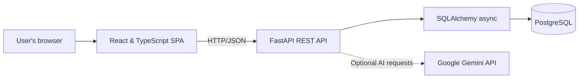

# 02 - Application Architecture

## React (Frontend)

### 1. What is it?
A JavaScript library for building user interfaces.

### 2. What problem does it solve?
Provides a dynamic, responsive SPA for inventory management dashboards and workflows.

### 3. Where is it used in StockMind?
User-facing frontend.

### 4. Is it implemented or planned?
**Status:** CURRENT

### 5. Why was it selected?
Industry standard, large ecosystem, component-based.

### 6. What alternatives were considered?
Vue, Angular, Svelte

### 7. Why were those alternatives not selected?
React was preferred for its vast ecosystem and existing familiarity.

### 8. What are the trade-offs?
Client-side rendering can impact initial load time without SSR.

### 9. What are the security implications?
No direct database access; must rely on secure backend APIs.

### 10. What are the operational implications?
Requires build pipelines (npm, Vite); adds complexity.

### 11. What are the cost implications?
Negligible (served as static files).

### 12. When should we reconsider it?
Reconsider if SEO becomes critical (move to Next.js) or if UI complexity demands a different paradigm.

### 13. What would replacing it look like?
Rewriting the UI layer in Vue or Svelte, setting up new build tools.

## FastAPI (Backend)

### 1. What is it?
A modern, fast web framework for building APIs with Python 3.7+ based on standard Python type hints.

### 2. What problem does it solve?
Provides high-performance async REST endpoints, request validation, and OpenAPI documentation.

### 3. Where is it used in StockMind?
Core backend service handling business logic and DB communication.

### 4. Is it implemented or planned?
**Status:** CURRENT

### 5. Why was it selected?
High performance (asyncio), automatic Swagger docs, Pydantic integration.

### 6. What alternatives were considered?
Django, Flask, Express.js

### 7. Why were those alternatives not selected?
Django was too heavy; Flask lacks async/validation out-of-the-box; Express changes language stack.

### 8. What are the trade-offs?
Requires understanding of async Python; smaller ecosystem than Django.

### 9. What are the security implications?
Input validation is robust via Pydantic, reducing injection risks.

### 10. What are the operational implications?
Requires ASGI server (Uvicorn) for execution.

### 11. What are the cost implications?
EC2/EKS compute costs for running the container.

### 12. When should we reconsider it?
Reconsider if the application requires heavy monolithic features (like an integrated admin panel) where Django excels.

### 13. What would replacing it look like?
Migrating routes to Flask or Django, refactoring validation logic.

