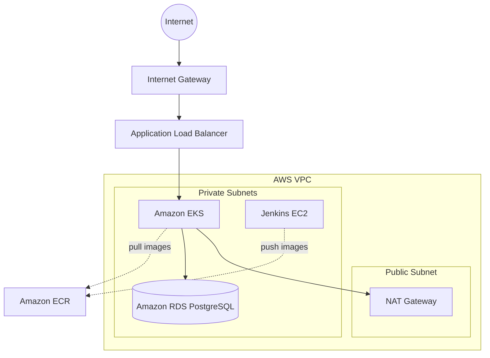

# 03 - AWS Architecture

## Amazon Web Services (AWS)

### 1. What is it?
A comprehensive, evolving cloud computing platform provided by Amazon.

### 2. What problem does it solve?
Provides the scalable infrastructure (compute, network, storage, DB) required to host StockMind.

### 3. Where is it used in StockMind?
Underlying cloud provider for the entire platform.

### 4. Is it implemented or planned?
**Status:** IMPLEMENTED

### 5. Why was it selected?
Market leader, robust managed services (EKS, RDS), excellent Terraform support.

### 6. What alternatives were considered?
Google Cloud Platform (GCP), Microsoft Azure

### 7. Why were those alternatives not selected?
Familiarity and specific ecosystem tools (like AWS Load Balancer Controller).

### 8. What are the trade-offs?
Vendor lock-in, complex pricing model.

### 9. What are the security implications?
Robust IAM and security groups provide strong defense-in-depth, but misconfiguration is a major risk.

### 10. What are the operational implications?
Requires high operational maturity to manage correctly.

### 11. What are the cost implications?
Can be expensive if resources (like NAT Gateways and EKS control planes) are left running unused.

### 12. When should we reconsider it?
Reconsider if costs become prohibitive or a multi-cloud strategy is mandated.

### 13. What would replacing it look like?
Complete infrastructure rewrite for Azure/GCP in Terraform; migrating data from RDS.

