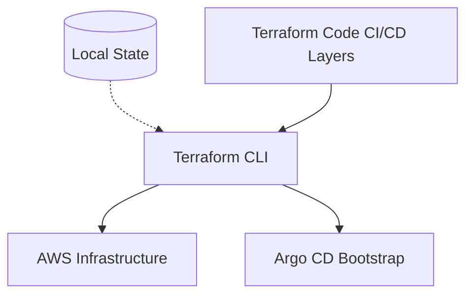

# 05 - Terraform

## Repository Structure
- `terraform/CI`: CI foundations (EC2, ECR, IAM, Security Groups, VPC).
- `terraform/CD`: CD foundations (EKS, RDS, Networking, Argo CD, Load Balancer Controller).

## Missing Components / Gaps Identified
- **Remote State:** State is currently local. Needs S3 backend and DynamoDB state locking.
- **Environment Separation:** Dev/Staging/Prod workspaces or directories are not fully implemented.
- **Modules:** Monolithic files are used instead of reusable modules.
- **Tagging:** Consistent resource tagging strategy is missing.
- **CI Validation:** No automated `terraform plan` on PRs yet.

## Terraform

### 1. What is it?
Infrastructure as Code tool.

### 2. What problem does it solve?
Allows repeatable, version-controlled provisioning of cloud infrastructure.

### 3. Where is it used in StockMind?
Used to provision the entire AWS platform layer.

### 4. Is it implemented or planned?
**Status:** IMPLEMENTED

### 5. Why was it selected?
Industry standard, provider support, declarative syntax.

### 6. What alternatives were considered?
OpenTofu, Pulumi, AWS CDK, CloudFormation, Crossplane

### 7. Why were those alternatives not selected?
OpenTofu is new, Pulumi/CDK change the paradigm to imperative code, CloudFormation is AWS-only, Crossplane requires a K8s cluster to bootstrap.

### 8. What are the trade-offs?
Requires learning HCL.

### 9. What are the security implications?
State file can contain secrets (must be secured).

### 10. What are the operational implications?
Requires state management and locking for team collaboration.

### 11. What are the cost implications?
Free and open-source tool, but provisions paid resources.

### 12. When should we reconsider it?
Reconsider if the team strongly prefers writing infrastructure in Python/TypeScript (Pulumi/CDK) or if shifting entirely to Kubernetes-native provisioning (Crossplane).

### 13. What would replacing it look like?
Rewriting all infrastructure code into another tool's syntax.

