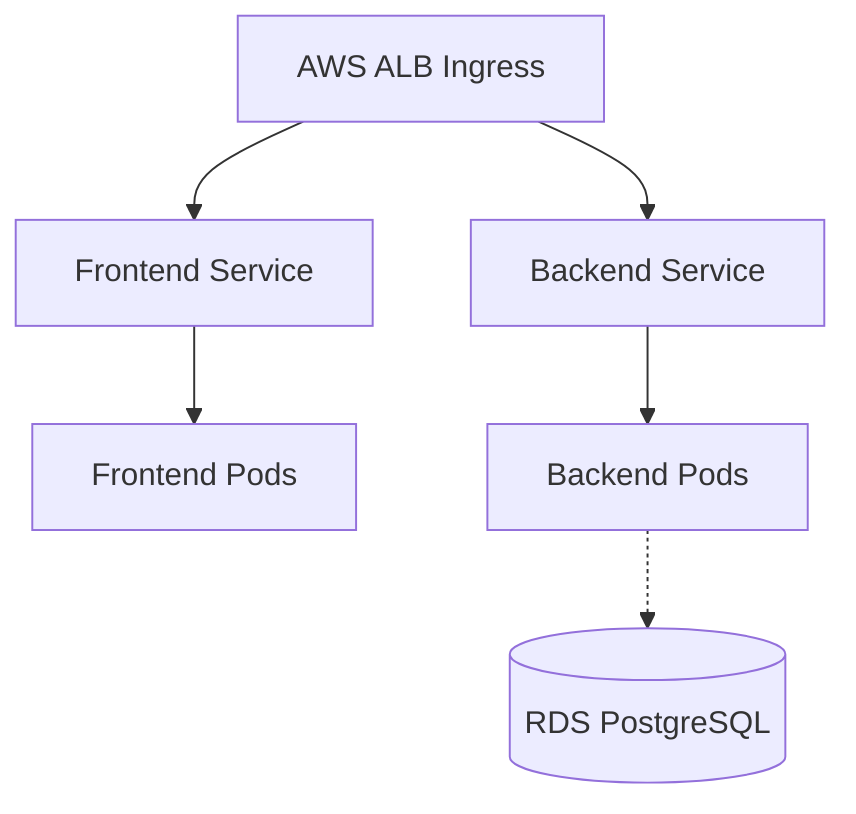

# 06 - Kubernetes Architecture

## Amazon EKS

### 1. What is it?
Managed Kubernetes Service by AWS.

### 2. What problem does it solve?
Orchestrates containerized applications, handles scaling, self-healing, and deployments.

### 3. Where is it used in StockMind?
Hosts the StockMind frontend, backend, Argo CD, and observability stack.

### 4. Is it implemented or planned?
**Status:** IMPLEMENTED

### 5. Why was it selected?
Reduces operational burden of managing the Kubernetes control plane.

### 6. What alternatives were considered?
Self-managed Kubernetes (kubeadm/kops), Amazon ECS

### 7. Why were those alternatives not selected?
Self-managed is too complex operationally. ECS lacks the massive Cloud Native ecosystem of K8s.

### 8. What are the trade-offs?
High baseline cost, complex IAM integration (IRSA), version upgrades require care.

### 9. What are the security implications?
Control plane is managed by AWS, highly secure. Worker nodes need security hardening.

### 10. What are the operational implications?
Simplifies cluster lifecycle, but K8s itself remains complex.

### 11. What are the cost implications?
~$73/month flat fee per cluster + EC2 node costs.

### 12. When should we reconsider it?
Reconsider if K8s proves too complex/expensive and simple container hosting (ECS/AppRunner) is sufficient.

### 13. What would replacing it look like?
Migrating K8s manifests to ECS Task Definitions.

