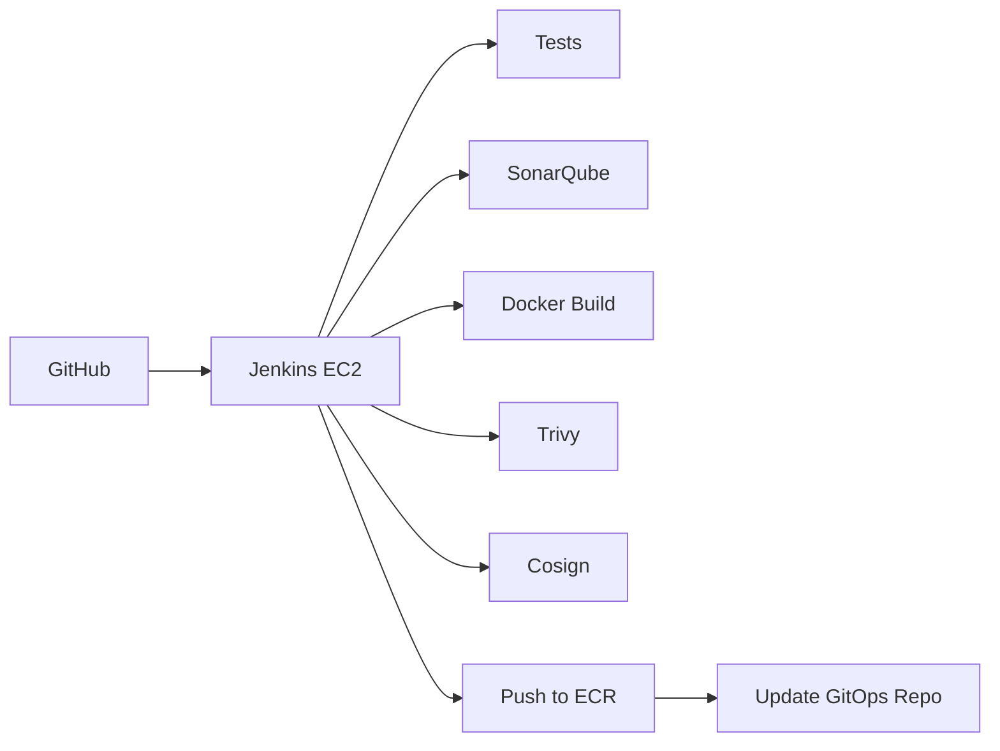

# 07 - CI/CD

## Jenkins

### 1. What is it?
An open-source automation server.

### 2. What problem does it solve?
Automates the building, testing, scanning, signing, and pushing of container images.

### 3. Where is it used in StockMind?
Runs on a dedicated EC2 instance provisioned by Terraform.

### 4. Is it implemented or planned?
**Status:** PLANNED (EC2 foundation exists)

### 5. Why was it selected?
Extremely flexible, large plugin ecosystem, allows full control over the execution environment.

### 6. What alternatives were considered?
GitHub Actions, GitLab CI, AWS CodeBuild

### 7. Why were those alternatives not selected?
GitHub Actions is SaaS (less control over runner infrastructure in this learning context), CodeBuild is vendor-locked.

### 8. What are the trade-offs?
Requires maintaining the Jenkins server itself (updates, plugins, security).

### 9. What are the security implications?
Jenkins has full access to ECR and source code. Must be strictly secured.

### 10. What are the operational implications?
High operational overhead (managing the EC2 instance, JVM, plugins).

### 11. What are the cost implications?
Cost of the EC2 instance + EBS volume running 24/7.

### 12. When should we reconsider it?
Reconsider if the operational burden of managing Jenkins becomes too high.

### 13. What would replacing it look like?
Migrating Jenkinsfiles to GitHub Actions YAML workflows.

