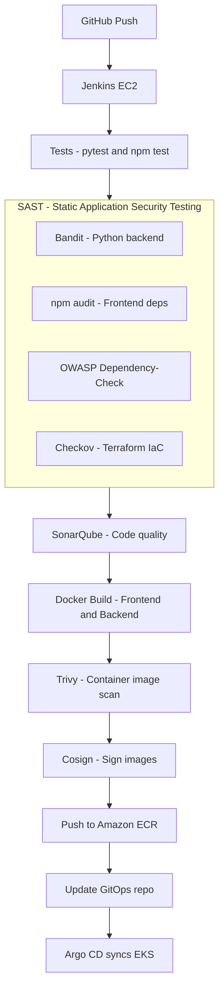

# 07 - CI/CD

## Pipeline Overview



> **Key principle:** Security gates run **before** expensive steps. SAST runs before Docker build. Trivy runs before signing and pushing. Fail fast; fail cheap.

---

## Pipeline Stage Breakdown

| Stage | Tool(s) | When it runs | Fails build if |
|---|---|---|---|
| Checkout | Git | Always first | Repo unreachable |
| Tests | pytest, npm test | After checkout | Any test fails |
| SAST — Python | Bandit | Before Docker build | HIGH severity + HIGH confidence |
| SAST — Frontend deps | npm audit | Before Docker build | HIGH or CRITICAL CVE |
| SAST — Dependencies | OWASP Dependency-Check | Before Docker build | CVSS score >= 7.0 |
| SAST — IaC | Checkov | Before Docker build | Soft-fail initially |
| Code quality | SonarQube | Before Docker build | Quality gate fails |
| Docker build | Docker | After SAST | Build error |
| Image scan | Trivy | After Docker build | CRITICAL CVE in image |
| Sign | Cosign | After Trivy pass | Signing error |
| Push | AWS ECR | After signing | Auth or network error |
| GitOps update | Git commit | After push | Commit/push error |

---

## Jenkins

### 1. What is it?
An open-source automation server that orchestrates the CI pipeline.

### 2. What problem does it solve?
Automates building, testing, security scanning, signing, and pushing of container images so that every code push goes through the same rigorous set of quality and security gates.

### 3. Where is it used in StockMind?
Runs on a dedicated EC2 instance (`t3.large`, 40 GB gp3) provisioned by Terraform in `terraform/CI/`. The instance has Jenkins, Docker, Trivy, Cosign, Bandit, Checkov, and OWASP Dependency-Check pre-installed.

### 4. Is it implemented or planned?
**Status:** PLANNED (EC2 foundation implemented; pipeline Jenkinsfile pending)

### 5. Why was it selected?
Extremely flexible, large plugin ecosystem, full control over the execution environment. Provides hands-on learning of a real CI server as opposed to a managed SaaS runner.

### 6. What alternatives were considered?
GitHub Actions, GitLab CI, AWS CodeBuild

### 7. Why were those alternatives not selected?
GitHub Actions is SaaS (less control, less to learn). CodeBuild is AWS-locked. Jenkins on EC2 provides the most educational depth for a DevOps learning project.

### 8. What are the trade-offs?
Jenkins requires ongoing maintenance (plugin updates, JVM tuning, security patching). This is managed by Ansible (Phase 1.5).

### 9. What are the security implications?
Jenkins holds AWS credentials (ECR push), GitHub credentials, and SonarQube tokens. Must be secured. Ansible handles SSH hardening and firewall rules.

### 10. What are the operational implications?
High operational overhead. Offset by Ansible configuration management.

### 11. What are the cost implications?
`t3.large` EC2 running 24/7 ≈ ~\$60/month. Can be stopped when not in use.

### 12. When should we reconsider it?
If maintaining Jenkins becomes too burdensome relative to value delivered.

### 13. What would replacing it look like?
Migrating Jenkinsfiles to GitHub Actions YAML workflows. Most stages translate 1:1.

---

## SAST (Static Application Security Testing)

SAST is integrated as four parallel stages in the Jenkins pipeline. It runs **after tests and before Docker build**.

For a complete explanation of what SAST is, how it differs from DAST, why each tool was selected, and how to handle false positives, see the dedicated SAST document:

> **[docs/10-security/SAST.md](../10-security/SAST.md)**

### Quick reference: SAST tools

| Tool | Scans | Key failure condition |
|---|---|---|
| **Bandit** | Python backend source | HIGH severity + HIGH confidence finding |
| **npm audit** | React frontend `package.json` | HIGH or CRITICAL CVE |
| **OWASP Dependency-Check** | `requirements.txt`, all deps | CVSS score >= 7.0 |
| **Checkov** | `terraform/` directory | Soft-fail initially; hardened later |

### Why SAST and not DAST yet?

DAST requires a **running deployed application** to test against. The GitOps test environment (Phase 7) is not yet in place. SAST provides meaningful, immediately usable security coverage that runs purely on source code. DAST (OWASP ZAP) is planned for Phase 7+.

See **[ADR-014](../14-decisions/ADR-014-SAST.md)** for the full decision record.

---

## Jenkinsfile — Complete Pipeline with SAST

```groovy
pipeline {
    agent any

    environment {
        AWS_REGION       = 'ap-south-1'
        ECR_REGISTRY     = '<account-id>.dkr.ecr.ap-south-1.amazonaws.com'
        IMAGE_TAG        = "${env.BUILD_NUMBER}"
        DEPCHECK_DATA    = '/var/jenkins_home/.dependency-check/data'
    }

    stages {

        // ─── Stage 1: Checkout ───────────────────────────────────────────
        stage('Checkout') {
            steps {
                checkout scm
            }
        }

        // ─── Stage 2: Tests ───────────────────────────────────────────────
        stage('Tests') {
            parallel {
                stage('Backend Tests') {
                    steps {
                        sh 'docker compose run --rm backend pytest -v'
                    }
                }
                stage('Frontend Type Check') {
                    steps {
                        dir('frontend') {
                            sh 'npm ci && npm run build'
                        }
                    }
                }
            }
        }

        // ─── Stage 3: SAST ────────────────────────────────────────────────
        // Runs BEFORE Docker build — fail fast on source-level issues.
        // See docs/10-security/SAST.md for full explanation of each tool.
        stage('SAST') {
            parallel {

                // Bandit: Python-native SAST for the FastAPI backend.
                // Catches: injection patterns, hardcoded secrets, weak crypto.
                // Fails on HIGH severity + HIGH confidence only.
                stage('SAST - Bandit (Python Backend)') {
                    steps {
                        sh '''
                          pip install bandit --quiet
                          # Generate JSON report (always, even on failure)
                          bandit -r backend/ -lll -iii \
                            -f json -o bandit-report.json || true
                          # This call sets the exit code Jenkins reads
                          bandit -r backend/ -lll -iii
                        '''
                    }
                    post {
                        always {
                            archiveArtifacts artifacts: 'bandit-report.json',
                                             allowEmptyArchive: true
                        }
                    }
                }

                // npm audit: Native npm dependency vulnerability scanner.
                // Checks package.json against the npm advisory database.
                // Fails on HIGH or CRITICAL severity findings.
                stage('SAST - npm audit (Frontend Dependencies)') {
                    steps {
                        dir('frontend') {
                            sh '''
                              npm ci --quiet
                              npm audit --audit-level=high
                            '''
                        }
                    }
                }

                // OWASP Dependency-Check: NVD-based dependency CVE scanning.
                // Scans requirements.txt against the National Vulnerability Database.
                // Complements Trivy (image layer) by scanning at source level.
                // Fails on CVSS score >= 7.0 (HIGH and CRITICAL).
                stage('SAST - OWASP Dependency-Check') {
                    steps {
                        sh '''
                          mkdir -p reports ${DEPCHECK_DATA}
                          dependency-check.sh \
                            --project "stockmind-${BUILD_NUMBER}" \
                            --scan backend/ \
                            --out reports/ \
                            --format HTML \
                            --format JSON \
                            --failOnCVSS 7 \
                            --data ${DEPCHECK_DATA} \
                            --suppression dependency-check-suppressions.xml \
                            --enableRetired
                        '''
                    }
                    post {
                        always {
                            dependencyCheckPublisher(
                                pattern: 'reports/dependency-check-report.xml',
                                failedTotalCritical: 1,
                                failedTotalHigh: 5
                            )
                            publishHTML(target: [
                                allowMissing: true,
                                reportDir: 'reports',
                                reportFiles: 'dependency-check-report.html',
                                reportName: 'OWASP Dependency-Check'
                            ])
                        }
                    }
                }

                // Checkov: Terraform IaC security misconfiguration scanner.
                // Checks terraform/ for open security groups, unencrypted storage,
                // overly permissive IAM, missing backup retention, etc.
                // --soft-fail: reports findings but does not fail build initially.
                // Remove --soft-fail once baseline findings are reviewed and suppressed.
                stage('SAST - Checkov (Terraform IaC)') {
                    steps {
                        sh '''
                          pip install checkov --quiet
                          mkdir -p reports
                          checkov \
                            -d terraform/ \
                            --compact \
                            --quiet \
                            --output-file-path reports/ \
                            --soft-fail
                        '''
                    }
                    post {
                        always {
                            archiveArtifacts artifacts: 'reports/results_*.json',
                                             allowEmptyArchive: true
                        }
                    }
                }
            }
        }

        // ─── Stage 4: SonarQube ───────────────────────────────────────────
        // Code quality + security hotspot detection.
        // Complements Bandit (which focuses on security only).
        stage('SonarQube Analysis') {
            steps {
                withSonarQubeEnv('SonarQube') {
                    sh '''
                      sonar-scanner \
                        -Dsonar.projectKey=stockmind \
                        -Dsonar.sources=backend/,frontend/src \
                        -Dsonar.python.version=3.10
                    '''
                }
            }
        }

        // ─── Stage 5: Docker Build ────────────────────────────────────────
        // Only reached if all SAST gates pass.
        stage('Docker Build') {
            parallel {
                stage('Build Frontend') {
                    steps {
                        sh "docker build -t stockmind-frontend:${IMAGE_TAG} ./frontend"
                    }
                }
                stage('Build Backend') {
                    steps {
                        sh "docker build -t stockmind-backend:${IMAGE_TAG} ./backend"
                    }
                }
            }
        }

        // ─── Stage 6: Trivy Image Scan ────────────────────────────────────
        // Scans the built container image for OS and runtime layer CVEs.
        // Complements OWASP Dependency-Check (which scans source deps).
        stage('Trivy Image Scan') {
            parallel {
                stage('Scan Frontend Image') {
                    steps {
                        sh '''
                          trivy image \
                            --exit-code 1 \
                            --severity CRITICAL \
                            --no-progress \
                            stockmind-frontend:${IMAGE_TAG}
                        '''
                    }
                }
                stage('Scan Backend Image') {
                    steps {
                        sh '''
                          trivy image \
                            --exit-code 1 \
                            --severity CRITICAL \
                            --no-progress \
                            stockmind-backend:${IMAGE_TAG}
                        '''
                    }
                }
            }
        }

        // ─── Stage 7: Sign and Push to ECR ───────────────────────────────
        stage('Sign and Push to ECR') {
            steps {
                sh '''
                  # Authenticate to ECR using EC2 Instance Role (no keys needed)
                  aws ecr get-login-password --region ${AWS_REGION} | \
                    docker login --username AWS --password-stdin ${ECR_REGISTRY}

                  # Frontend
                  docker tag stockmind-frontend:${IMAGE_TAG} \
                    ${ECR_REGISTRY}/stockmind-frontend:${IMAGE_TAG}
                  docker push ${ECR_REGISTRY}/stockmind-frontend:${IMAGE_TAG}
                  cosign sign ${ECR_REGISTRY}/stockmind-frontend:${IMAGE_TAG}

                  # Backend
                  docker tag stockmind-backend:${IMAGE_TAG} \
                    ${ECR_REGISTRY}/stockmind-backend:${IMAGE_TAG}
                  docker push ${ECR_REGISTRY}/stockmind-backend:${IMAGE_TAG}
                  cosign sign ${ECR_REGISTRY}/stockmind-backend:${IMAGE_TAG}
                '''
            }
        }

        // ─── Stage 8: Update GitOps Repository ───────────────────────────
        // Updates image tags in Stockmind-Ops k8s/ manifests.
        // Argo CD will detect the change and sync EKS automatically.
        stage('Update GitOps Repository') {
            steps {
                sh '''
                  git clone https://github.com/shishir-krishna-101/Stockmind-Ops.git gitops
                  sed -i "s|stockmind-frontend:.*|stockmind-frontend:${IMAGE_TAG}|g" \
                    gitops/k8s/frontend/deployment.yaml
                  sed -i "s|stockmind-backend:.*|stockmind-backend:${IMAGE_TAG}|g" \
                    gitops/k8s/backend/deployment.yaml
                  cd gitops
                  git config user.email "ci@stockmind"
                  git config user.name "Jenkins CI"
                  git commit -am "ci: bump image tags to build ${IMAGE_TAG}"
                  git push
                '''
            }
        }
    }

    post {
        failure {
            echo 'Pipeline failed. Check the stage that failed and review the archived reports.'
        }
        success {
            echo 'Pipeline succeeded. Argo CD will sync EKS within ~3 minutes.'
        }
        always {
            // Clean up local Docker images to prevent disk exhaustion on the CI server
            sh '''
              docker rmi stockmind-frontend:${IMAGE_TAG} || true
              docker rmi stockmind-backend:${IMAGE_TAG} || true
            '''
        }
    }
}
```

---

## Security Layer Summary

The pipeline enforces **defence in depth** — no single tool covers everything.

```
Source code level (SAST):
  Bandit            → Python injection, crypto, secrets
  npm audit         → Frontend npm CVEs
  Dependency-Check  → Python deps against NVD
  Checkov           → Terraform misconfigurations

Code quality level:
  SonarQube         → Quality gate, security hotspots

Container level:
  Trivy             → OS packages, runtime image CVEs

Provenance level:
  Cosign            → Cryptographic image signature

Runtime level (PLANNED - Phase 7+):
  OWASP ZAP (DAST)  → Live application attack simulation
  NetworkPolicy     → Pod-to-pod traffic restriction
  Istio             → mTLS between services
```
