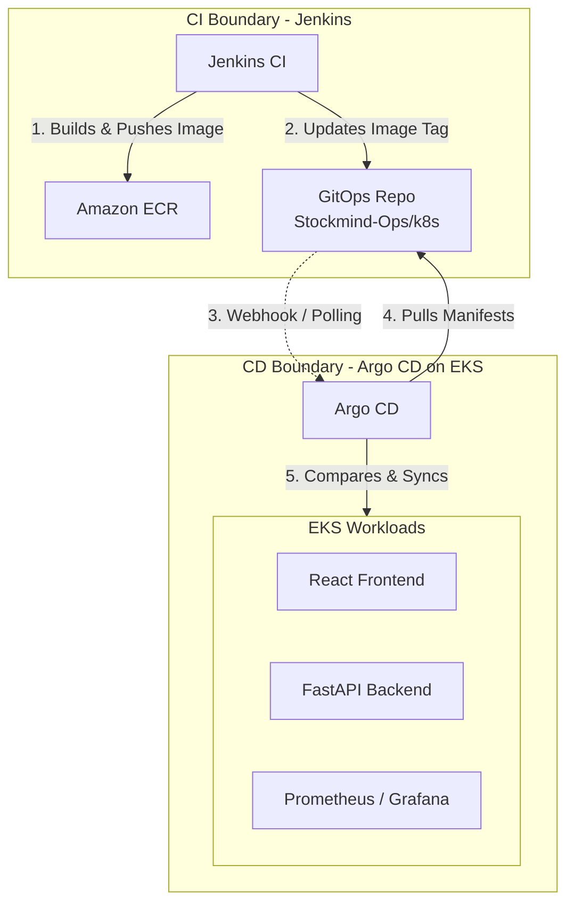

# 08 - GitOps (Continuous Delivery)

## CD Pipeline Overview

The Continuous Delivery (CD) phase in StockMind is entirely **pull-based**, governed by Argo CD. Jenkins (CI) never touches the EKS cluster directly. Instead, Jenkins updates the configuration in Git, and Argo CD synchronizes the cluster to match Git.



---

## Argo CD Application Structure

Argo CD manages workloads using `Application` Custom Resources. In StockMind, the "App of Apps" pattern is planned, where one root Argo CD Application manages all other Applications.

### GitOps Repository Directory Structure

The GitOps state is stored within this same repository (`Stockmind-Ops`) under the `k8s/` directory:

```text
Stockmind-Ops/
└── k8s/
    ├── apps/
    │   ├── root-app.yaml           # The App of Apps manifest
    │   ├── frontend-app.yaml       # Defines the frontend Application
    │   └── backend-app.yaml        # Defines the backend Application
    │
    ├── frontend/
    │   ├── deployment.yaml         # Contains the image tag Jenkins updates
    │   ├── service.yaml
    │   └── ingress.yaml
    │
    └── backend/
        ├── deployment.yaml         # Contains the image tag Jenkins updates
        ├── service.yaml
        ├── externalsecret.yaml     # Pulls JWT/Gemini secrets from AWS
        └── hpa.yaml                # Autoscaling rules
```

---

## The Pipeline Manifests

### 1. The CI Handoff (How Jenkins triggers CD)

In the final stage of the Jenkins CI pipeline, Jenkins commits the new image tag directly to the `deployment.yaml` files.

*Jenkins runs this command:*
```bash
sed -i "s|stockmind-backend:.*|stockmind-backend:${IMAGE_TAG}|g" k8s/backend/deployment.yaml
git commit -am "ci: bump image tags to build ${IMAGE_TAG}"
git push
```

### 2. The Argo CD Application Definition

Argo CD uses `Application` definitions to know what to watch and where to deploy it. 

**`k8s/apps/backend-app.yaml`:**
```yaml
apiVersion: argoproj.io/v1alpha1
kind: Application
metadata:
  name: stockmind-backend
  namespace: argocd
spec:
  project: default
  source:
    repoURL: 'https://github.com/shishir-krishna-101/Stockmind-Ops.git'
    targetRevision: main
    path: k8s/backend
  destination:
    server: 'https://kubernetes.default.svc'
    namespace: stockmind-prod
  syncPolicy:
    automated:
      prune: true       # Delete resources no longer in Git
      selfHeal: true    # Revert manual changes made directly in EKS
    syncOptions:
      - CreateNamespace=true
```

### 3. Sync Policies & Self-Healing

The CD pipeline relies on Argo CD's strict reconciliation loop:

- **Automated Sync:** When Jenkins pushes a new commit to `main`, Argo CD automatically applies the new manifests.
- **Auto-Prune (`prune: true`):** If a developer removes `hpa.yaml` from Git, Argo CD automatically deletes the HorizontalPodAutoscaler from EKS. Git is the absolute source of truth.
- **Self-Heal (`selfHeal: true`):** If an operator manually runs `kubectl edit deployment stockmind-backend` in an emergency, Argo CD will detect the drift and immediately overwrite the manual change with the state from Git.

---

## Core Argo CD Components

### 1. What is it?
A declarative, GitOps continuous delivery tool for Kubernetes.

### 2. What problem does it solve?
It decouples CI (building images) from CD (deploying to the cluster). It ensures the cluster exactly matches the Git repository, eliminating configuration drift and preventing manual "cowboy" changes.

### 3. Where is it used in StockMind?
It is installed in the EKS cluster (bootstrapped by Terraform in `terraform/CD/argocd.tf`). It will manage all application workloads, external secrets, and observability tools.

### 4. Is it implemented or planned?
**Status:** PARTIALLY IMPLEMENTED.
- **Implemented:** The Argo CD core system is installed via Terraform.
- **Planned:** The actual application manifests (`k8s/` directory) and the App definitions.

### 5. Why was it selected?
Industry standard for GitOps on Kubernetes. Superior UI for visualizing deployment states, excellent drift detection, and native support for Kustomize and Helm.

### 6. What alternatives were considered?
Flux CD, Jenkins CD (Push-based), GitHub Actions Deployment.

### 7. Why were those alternatives not selected?
- **Push-based CD (Jenkins/GitHub Actions):** Requires storing powerful EKS admin credentials inside the CI system. If CI is breached, the cluster is breached.
- **Flux CD:** A very strong alternative, but Argo CD was chosen for its superior Web UI, which is highly beneficial for a project with an educational and operational focus.

### 8. What are the trade-offs?
Requires maintaining Argo CD components inside the EKS cluster. It adds a layer of abstraction (developers must learn to look at Argo CD, not just Jenkins, to see if a deployment succeeded).

### 9. What are the security implications?
Significantly improves security. The CI server (Jenkins) has zero access to the EKS cluster. EKS pulls changes from Git. The only credentials Argo CD needs are read-only access to the Git repository.

### 10. What are the operational implications?
Simplifies disaster recovery. If the EKS cluster is destroyed, a new cluster can be spun up, Argo CD installed, and pointed at the Git repository — the entire application state will restore itself automatically within minutes.

### 11. What are the cost implications?
Negligible. Argo CD runs as a few lightweight pods inside the existing EKS cluster.

### 12. When should we reconsider it?
If the project shifts away from Kubernetes (e.g., to ECS or Serverless), Argo CD would no longer apply.

### 13. What would replacing it look like?
Migrating Argo Application manifests to Flux Kustomizations, or reverting to a push-based model where Jenkins runs `kubectl apply` directly.

---

## Next Steps for CD Implementation

To fully implement the CD pipeline (Phase 7):
1. Create the `k8s/` directory structure.
2. Write the base Kubernetes manifests for Frontend and Backend.
3. Write the Argo CD `Application` manifests.
4. Manually apply the App of Apps root manifest to EKS to start the GitOps loop.
