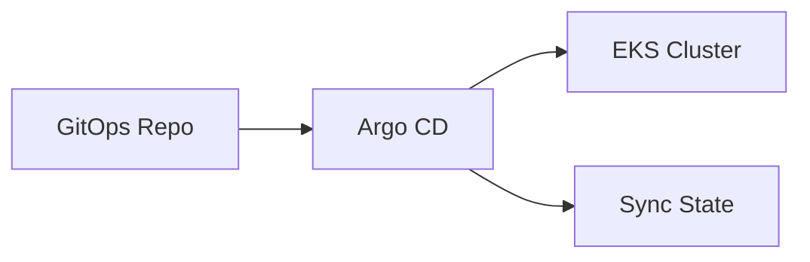

# 08 - GitOps

## Argo CD

### 1. What is it?
A declarative, GitOps continuous delivery tool for Kubernetes.

### 2. What problem does it solve?
Ensures the Kubernetes cluster state matches the state defined in Git.

### 3. Where is it used in StockMind?
Bootstrapped by Terraform into EKS, will manage all application workloads.

### 4. Is it implemented or planned?
**Status:** PARTIALLY IMPLEMENTED (Bootstrap done, apps pending)

### 5. Why was it selected?
Excellent UI, deep K8s integration, industry standard for GitOps.

### 6. What alternatives were considered?
Flux, Jenkins CD, GitHub Actions Deployment

### 7. Why were those alternatives not selected?
Push-based CD (Jenkins) requires granting CI access to the cluster. Flux is good but Argo's UI is superior for visibility.

### 8. What are the trade-offs?
Requires maintaining Argo CD components inside the cluster.

### 9. What are the security implications?
Extremely secure (pull-based); CI system doesn't need cluster credentials.

### 10. What are the operational implications?
Simplifies rollbacks and disaster recovery.

### 11. What are the cost implications?
Negligible (runs inside the existing EKS cluster).

### 12. When should we reconsider it?
Reconsider if multi-cluster management becomes too complex.

### 13. What would replacing it look like?
Migrating Argo Application manifests to Flux Kustomizations.

