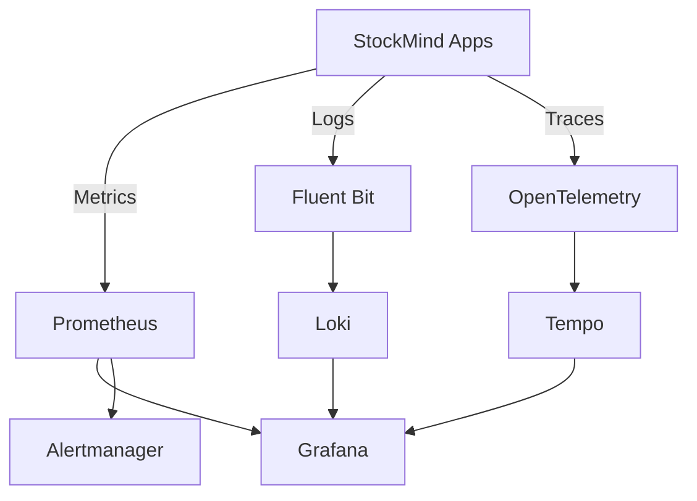

# 09 - Observability

## Prometheus & Grafana

### 1. What is it?
Metrics monitoring and alerting toolkit + Visualization platform.

### 2. What problem does it solve?
Collects metrics from the cluster and applications, visualizes them, and triggers alerts.

### 3. Where is it used in StockMind?
Core of the observability stack in EKS.

### 4. Is it implemented or planned?
**Status:** PLANNED

### 5. Why was it selected?
Industry standard for Kubernetes monitoring.

### 6. What alternatives were considered?
AWS CloudWatch, Datadog

### 7. Why were those alternatives not selected?
CloudWatch is expensive for custom metrics. Datadog is commercial/expensive.

### 8. What are the trade-offs?
Requires managing storage (EBS) and resource overhead in the cluster.

### 9. What are the security implications?
Metrics can reveal business volume; Grafana must be secured via authentication.

### 10. What are the operational implications?
Requires tuning scrape intervals and retention to manage storage.

### 11. What are the cost implications?
Cost of EBS volumes for Prometheus TSDB storage.

### 12. When should we reconsider it?
Reconsider if managing the stack becomes too burdensome and a managed service (Prometheus on AWS) is preferred.

### 13. What would replacing it look like?
Replacing Helm charts with AWS managed Prometheus/Grafana.

## Fluent Bit & Loki

### 1. What is it?
Log processor/forwarder and log aggregation system.

### 2. What problem does it solve?
Collects container logs and stores them efficiently using label-based indexing.

### 3. Where is it used in StockMind?
Log pipeline in EKS.

### 4. Is it implemented or planned?
**Status:** PLANNED

### 5. Why was it selected?
Loki is highly cost-effective (stores in S3, minimal indexing) compared to Elasticsearch.

### 6. What alternatives were considered?
Elasticsearch/Fluentd/Kibana (EFK), Vector, OpenSearch

### 7. Why were those alternatives not selected?
EFK/OpenSearch is very resource-intensive (JVM memory, heavy indexing).

### 8. What are the trade-offs?
Loki queries (LogQL) are less flexible for full-text search without labels.

### 9. What are the security implications?
Logs must not contain sensitive PII (requires masking in Fluent Bit).

### 10. What are the operational implications?
Fluent Bit is very lightweight.

### 11. What are the cost implications?
Highly cost-effective due to S3 backend for Loki.

### 12. When should we reconsider it?
Reconsider if complex full-text analytics are required.

### 13. What would replacing it look like?
Migrating to OpenSearch.

