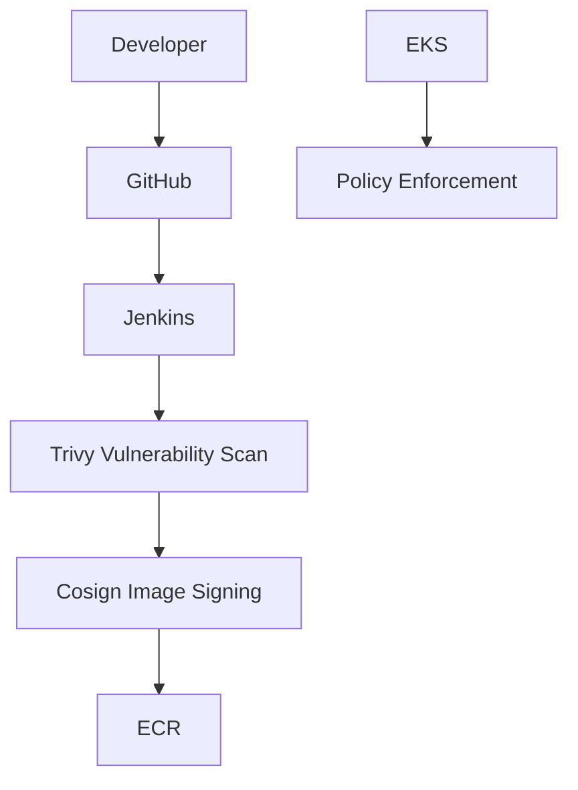

# 10 - Security

## Trivy & Cosign

### 1. What is it?
Container vulnerability scanner and OCI artifact signing tool.

### 2. What problem does it solve?
Ensures images are free of known CVEs and cryptographically verifies image provenance.

### 3. Where is it used in StockMind?
Jenkins CI pipeline.

### 4. Is it implemented or planned?
**Status:** PLANNED

### 5. Why was it selected?
Trivy is fast and accurate; Cosign uses keyless signing and OIDC.

### 6. What alternatives were considered?
Snyk, Grype, AWS Inspector, Docker Notary

### 7. Why were those alternatives not selected?
Snyk is commercial. AWS Inspector is AWS-specific. Notary is overly complex.

### 8. What are the trade-offs?
Build times increase.

### 9. What are the security implications?
Prevents deployment of compromised or untrusted images.

### 10. What are the operational implications?
Requires managing signing keys (KMS) or OIDC identities.

### 11. What are the cost implications?
Trivy/Cosign are free open-source tools.

### 12. When should we reconsider it?
Reconsider if shifting to AWS native security (Inspector).

### 13. What would replacing it look like?
Replacing Jenkins stages with AWS Inspector automated scanning.

