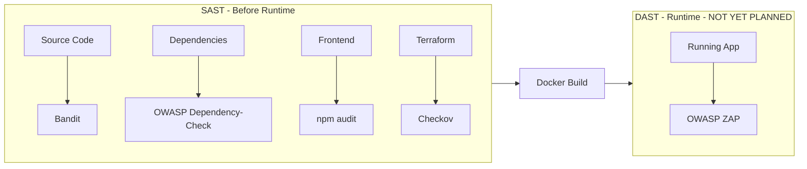
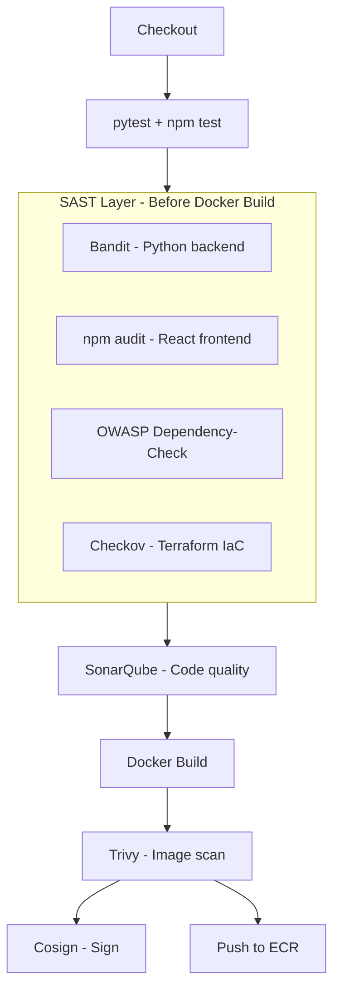

# SAST — Static Application Security Testing

**Status:** PLANNED
**Layer:** Jenkins CI Pipeline — runs before Docker build
**See also:** [ADR-014: SAST Decision](../14-decisions/ADR-014-SAST.md)

---

## What Is SAST?

SAST stands for **Static Application Security Testing**. It analyses your **source code, dependencies, and configuration files without ever executing the application**.

Think of it as a specialised code reviewer that reads every file looking for:
- Dangerous function calls (e.g. `eval()`, `subprocess` with `shell=True`)
- Hardcoded credentials in code
- Insecure dependency versions with known CVEs
- Misconfigured infrastructure (open security groups, unencrypted storage)
- Code patterns that match OWASP Top 10 vulnerabilities

---

## SAST vs DAST — The Critical Difference

Understanding this distinction matters because they are complementary, not competing.



| Dimension | SAST | DAST |
|---|---|---|
| **What it analyses** | Source code, config, dependencies | A live running application |
| **When it runs** | Before Docker build (early in pipeline) | After deployment to a test environment |
| **What it finds** | Code-level vulnerabilities, insecure patterns, bad dependencies | Runtime issues, injection attacks, auth bypasses, misconfigured headers |
| **Speed** | Fast (seconds to minutes) | Slow (minutes to hours) |
| **False positive rate** | Medium — code patterns can look dangerous without being exploitable | Lower — it actually attacked the app |
| **What it needs** | Just the code | A deployed, running instance |
| **Cost** | Free tools available | Free tools available (OWASP ZAP) but needs a running environment |
| **Example finding** | `subprocess.call(user_input, shell=True)` — shell injection risk | HTTP 500 returned when SQL characters are submitted to a login form |

---

## Why SAST Was Chosen for StockMind Now (and DAST Is Deferred)

### SAST is prioritised because:

1. **No infrastructure dependency.** SAST runs purely on source code. It does not need EKS, a staging environment, or the application deployed anywhere. This makes it immediately usable at the current project stage.

2. **Catches the most impactful issues early.** The majority of serious vulnerabilities (insecure dependencies, hardcoded secrets, injection-prone code patterns) are detectable at the source level before a single container is built.

3. **Fail-fast principle.** Stopping a build at the SAST stage before Docker build costs seconds. Discovering the same issue after deployment costs significantly more time and creates a more complex remediation path.

4. **Aligns with the current project phase.** The Jenkins pipeline is being built now. SAST is a natural first-layer security gate.

5. **All chosen tools are free and open source.** Zero licensing cost.

### Why DAST is deferred (not abandoned):

DAST requires a live running application to test against. Without a stable test environment deployment pipeline (Phase 7 GitOps), running DAST correctly is premature. Adding DAST before a reliable test deployment exists would either:
- Test against a Docker Compose stack (limited coverage, not representative of production)
- Block the pipeline on a flaky or slow environment spin-up

**DAST is planned for a later phase** once the EKS test environment and GitOps pipeline are stable. The leading candidate is **OWASP ZAP** with a FastAPI API scan using the auto-generated `/openapi.json` spec.

---

## Tools Selected for StockMind SAST

Four tools cover four distinct layers. Each is chosen for a specific reason. They do not duplicate each other.

---

### Tool 1: Bandit — Python Backend SAST

**What it is:** An open-source Python-specific static analysis tool designed to find common security issues in Python code.

**What problem does it solve?**
The FastAPI backend is Python. Generic SAST tools often miss Python-specific vulnerabilities. Bandit understands Python semantics deeply and checks for patterns that are specifically dangerous in Python.

**What it checks for (OWASP Top 10 relevance):**

| Bandit check | OWASP category |
|---|---|
| `subprocess` with `shell=True` | A03: Injection |
| `eval()` / `exec()` with user input | A03: Injection |
| SQL query string concatenation | A03: Injection |
| Hardcoded passwords, tokens, keys | A02: Cryptographic Failures |
| Use of weak cryptography (`MD5`, `SHA1`) | A02: Cryptographic Failures |
| `assert` used for access control | A01: Broken Access Control |
| Binding to `0.0.0.0` | A05: Security Misconfiguration |
| Use of `pickle` (arbitrary code exec risk) | A08: Software/Data Integrity |

**Why Bandit over alternatives?**

| Alternative | Reason not selected |
|---|---|
| SonarQube alone | SonarQube's Python security rules are less comprehensive than Bandit's Python-native ruleset. Both run together. |
| Semgrep | More powerful but requires custom rule authoring. Bandit works well out of the box for Python. Can be added later. |
| Pylint with security plugin | Primarily a code quality tool, not a security tool. |

**How to configure:**

```ini
# backend/.bandit
[bandit]
exclude_dirs = tests,venv,.venv
skips = B101    # Skip assert_used check in test files
```

**Jenkins command:**

```bash
# Install
pip install bandit

# Run — fail only on HIGH severity + HIGH confidence
# -l = severity level (low/medium/high)
# -i = confidence level (low/medium/high)
bandit -r backend/ -lll -iii -f json -o bandit-report.json
bandit -r backend/ -lll -iii      # This one sets the exit code for Jenkins
```

**Interpreting results:**

```
Severity: HIGH   Confidence: HIGH  → Fix immediately, block the build
Severity: HIGH   Confidence: MEDIUM → Fix before release
Severity: MEDIUM Confidence: HIGH  → Review, fix if confirmed exploitable
Severity: LOW    → Informational only, do not fail build
```

---

### Tool 2: npm audit — React Frontend Dependency Scanning

**What it is:** npm's built-in vulnerability scanner. Checks `package.json` and `package-lock.json` against the npm security advisory database.

**What problem does it solve?**
The React frontend uses many third-party npm packages (TanStack Query, Axios, Zustand, etc.). Any of these can have published CVEs. `npm audit` catches these at the source level before they make it into a container image.

**Note on overlap with Trivy:**
- `npm audit` scans `package.json` at the **source level** in CI before Docker build.
- Trivy scans the **built image** after Docker build.
- Running both catches dependency vulnerabilities at two points. Fail fast with `npm audit` before even building.

**Why npm audit over alternatives?**

| Alternative | Reason not selected |
|---|---|
| Snyk for npm | Commercial (free tier limited). Requires Snyk account and token. npm audit is zero-setup. |
| OWASP Dependency-Check (for npm) | Dependency-Check works better for JVM and Python ecosystems. npm audit is native and more accurate for npm packages. |

**Jenkins command:**

```bash
cd frontend/

# Install dependencies first (needed for lock file to exist)
npm ci

# Audit — fail on high+ severity
npm audit --audit-level=high
```

---

### Tool 3: OWASP Dependency-Check — Multi-Ecosystem CVE Scanning

**What it is:** OWASP Dependency-Check is a Software Composition Analysis (SCA) tool that identifies publicly disclosed vulnerabilities in project dependencies by checking against the **National Vulnerability Database (NVD)**.

**What problem does it solve?**
A comprehensive, authoritative dependency vulnerability scanner that covers the Python backend (`requirements.txt`) against the NVD — the same database that drives CVE advisories worldwide.

**Why OWASP Dependency-Check in addition to Trivy?**

This is the most common question. The distinction is important:

| Dimension | Trivy | OWASP Dependency-Check |
|---|---|---|
| Primary target | Container images, filesystems, IaC | Application dependencies (requirements.txt, pom.xml, package.json) |
| When it runs | After Docker build | Before Docker build (source level) |
| NVD database | Uses its own advisories database | Directly queries NVD |
| Reporting | Console / JSON | Rich HTML report with evidence |
| Jenkins plugin | No official plugin | Official Jenkins plugin with trend graphs |
| Best for | Container/OS layer vulnerabilities | Application dependency CVEs |

Both run in the pipeline. They serve different layers. Trivy is not a replacement for Dependency-Check, and vice versa.

**Performance note:** Dependency-Check downloads the NVD database on first run (~500 MB). Cache the `~/.dependency-check/data` directory on the Jenkins EC2 EBS volume to keep subsequent runs to ~30 seconds.

**Jenkins command:**

```bash
dependency-check.sh \
  --project "stockmind" \
  --scan backend/ \
  --out reports/ \
  --format HTML \
  --format JSON \
  --failOnCVSS 7 \
  --data /var/jenkins_home/.dependency-check/data   # Cached NVD DB
```

`--failOnCVSS 7` means: fail the build if any dependency has a CVSS score of 7.0 or higher (HIGH or CRITICAL).

---

### Tool 4: Checkov — Terraform IaC Security Scanning

**What it is:** An open-source static analysis tool for Infrastructure as Code. It checks Terraform, Kubernetes manifests, Dockerfiles, and other IaC files against a library of 1000+ security and compliance checks.

**What problem does it solve?**
Your Terraform code provisions real AWS infrastructure. Misconfigurations in Terraform lead to real security gaps — open security groups, unencrypted RDS, public S3 buckets, overly permissive IAM. Checkov catches these before `terraform apply` ever runs.

**What it checks in StockMind's Terraform:**

| Check | File it applies to | OWASP/CIS relevance |
|---|---|---|
| `publicly_accessible = false` on RDS | `terraform/CD/rds.tf` | CIS AWS 4.3 |
| `storage_encrypted = true` on RDS | `terraform/CD/rds.tf` | CIS AWS 4.4 |
| Security group not open on `0.0.0.0/0` | `terraform/CI/security_group.tf` | CIS AWS 4.1 |
| IAM role not using wildcard `*` resources | `terraform/CI/iam.tf` | CIS AWS 1.x |
| Backup retention set on RDS | `terraform/CD/rds.tf` | Operational/DR |
| ECR image scanning enabled | `terraform/CI/ecr.tf` | NIST |

**Why Checkov over alternatives?**

| Alternative | Reason not selected |
|---|---|
| tfsec | Good tool, but Checkov covers more IaC types (Terraform, Dockerfiles, K8s). Single tool is simpler. |
| Trivy `--scanners config` | Trivy can scan IaC, but Checkov has more Terraform-specific rules and better reporting. Choose one; Checkov is the standard. |
| Terrascan | Less widely used, smaller community. |

**Jenkins command:**

```bash
pip install checkov

checkov \
  -d terraform/ \
  --compact \
  --quiet \
  --output-file-path reports/ \
  --soft-fail    # For now: report but don't fail build
                 # Remove --soft-fail once baseline is established
```

> Start with `--soft-fail` to see the initial findings without blocking the pipeline. Once known findings are suppressed or fixed, remove `--soft-fail` to enforce the gate.

---

## SAST in the Jenkins Pipeline — Exact Placement

SAST runs **after tests and before Docker build**. This is the correct position:



**Why SAST before Docker build, not after?**

If Bandit finds a `shell=True` subprocess call, there is no value in building the Docker image first. Fail early, fix early. The Docker build step itself takes 2–5 minutes — catching the issue before it saves that time on every affected build.

---

## False Positives — How to Handle Them

Every SAST tool produces false positives. Here is how to handle them properly in StockMind:

### Bandit — inline suppression

```python
# nosec B603 -- input is validated upstream by Pydantic, not user-controlled
result = subprocess.run(["pg_dump", db_name], capture_output=True)  # nosec
```

Use `# nosec` with the check ID and a **comment explaining why it is safe**. Never use `# nosec` without explanation.

### OWASP Dependency-Check — suppression file

```xml
<!-- dependency-check-suppressions.xml -->
<suppressions>
  <suppress>
    <notes>CVE-2023-XXXX - only affects feature X which we do not use</notes>
    <cve>CVE-2023-XXXX</cve>
  </suppress>
</suppressions>
```

```bash
dependency-check.sh ... --suppression dependency-check-suppressions.xml
```

### Checkov — inline skip

```hcl
# checkov:skip=CKV_AWS_157: Multi-AZ not required for dev environment
resource "aws_db_instance" "postgres" {
  multi_az = false
  ...
}
```

Always provide the check ID and the reason.

---

## DAST — Deferred (Documented for Future)

DAST is not implemented in this phase. It is documented here to preserve the decision context.

**What DAST would add:**
- Attack the running application from the outside as an attacker would
- Find runtime issues: HTTP header misconfiguration, session management flaws, API endpoint vulnerabilities not visible in source

**Planned DAST tool:** OWASP ZAP
**Planned trigger:** After deployment to a dedicated `stockmind-test` Kubernetes namespace
**Why deferred:** Requires a stable GitOps-managed test environment, which is Phase 7. Adding DAST before Phase 7 would mean testing against a Docker Compose stack that does not accurately represent production.

**Future pipeline position:**

```
ECR Push
  ↓
GitOps update → Argo CD deploys to stockmind-test namespace
  ↓
OWASP ZAP API scan against test deployment (using /openapi.json)
  ↓
If clean → promote to production namespace
```

---

## Summary: SAST Tool Matrix

| Tool | Target layer | Catches | Exit code behaviour | Build time added |
|---|---|---|---|---|
| **Bandit** | Python source code | Injection, crypto, hardcoded secrets | Fails on HIGH+HIGH | ~30 seconds |
| **npm audit** | Frontend dependencies | Known CVEs in npm packages | Fails on HIGH+ | ~10 seconds |
| **OWASP Dependency-Check** | Backend dependencies | NVD CVEs in Python packages | Fails on CVSS ≥ 7.0 | ~30s (cached) / 5–8 min (cold) |
| **Checkov** | Terraform IaC | Misconfigurations, compliance | Soft-fail initially | ~60 seconds |
| **SonarQube** | All source code | Code quality + security hotspots | Quality gate | ~2–3 minutes |
| **Trivy** | Container image | OS layer + image CVEs | Fails on CRITICAL | ~60 seconds |
