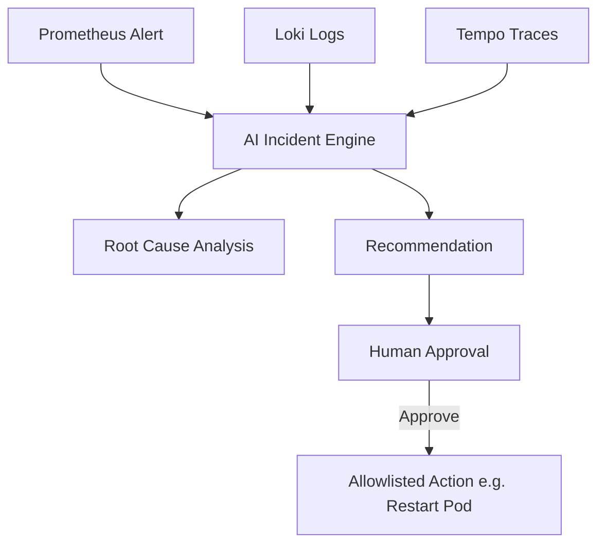

# 11 - AI Incident Engine

## Safety Model
The AI Incident Engine must **never** have unrestricted Kubernetes cluster access.
- Read access to observability data only.
- Output is an RCA report and a suggested action.
- Execution requires a separate, hardened executor component.
- The executor only performs predefined, allowlisted actions (e.g., `restart`, `scale`, `rollback`).
- A human must explicitly approve the action via an interface before the executor runs it.
